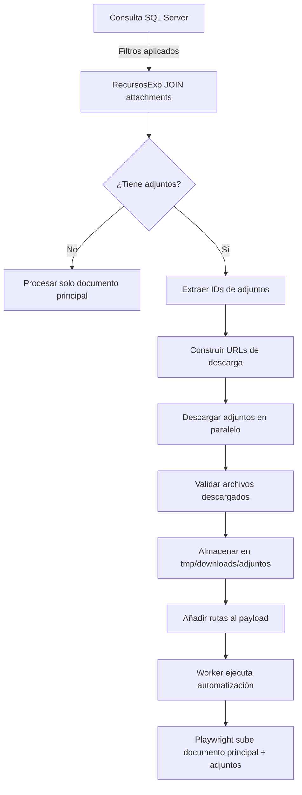

# 📋 PLAN DE ACCIÓN: Sistema de Descarga de Adjuntos Dinámicos

> **Versión:** 1.0  
> **Fecha:** 2026-01-22  
> **Rol:** Especialista en Automatización de Procesos de Extracción y Gestión Documental  
> **Estado:** Pendiente de implementación

---

## 🎯 Objetivo General

Implementar un sistema automatizado de identificación y descarga de documentos adjuntos desde la base de datos SQL Server, integrándolo con el flujo de trabajo existente del worker de Playwright para que los archivos descargados estén disponibles durante el proceso de automatización.

---

## 📊 Contexto Técnico

### Base de Datos SQL Server

**Tablas Involucradas:**

1. **`Recursos.RecursosExp`** (Tabla principal de expedientes)
   - `idRecurso` (PK): Identificador único del expediente
   - `Expedient`: Número de expediente
   - `Estado`: Estado del expediente (0 = pendiente)
   - `TExp`: Tipo de expediente (2 = generado al vuelo, 3 = en carpeta servidor)
   - `automatic_id`: Clave foránea para relación con adjuntos

2. **`attachments_resource_documents`** (Tabla de adjuntos)
   - `id` (PK): Identificador único del adjunto
   - `automatic_id` (FK): Relación con `RecursosExp`
   - `Filename`: Nombre del archivo adjunto

### Endpoint de Descarga

```
http://www.xvia-grupoeuropa.net/intranet/xvia-grupoeuropa/public/servicio/recursos/expedientes/pdf-adjuntos/{id}
```

Donde `{id}` corresponde al campo `id` de la tabla `attachments_resource_documents`.

---

## 🔄 Flujo de Ejecución Propuesto



---

## 📝 Reglas de Filtrado en Origen

### Criterios de Selección (SQL WHERE)

```sql
WHERE 
    rs.Estado = 0                    -- Solo expedientes pendientes
    AND rs.TExp IN (2, 3)            -- Solo documentos generados al vuelo o en servidor
```

### Query SQL Modificada

```sql
SELECT
    rs.idRecurso,
    rs.Expedient,
    rs.Matricula,
    rs.DtaDenuncia,
    rs.Organisme,
    rs.automatic_id,
    c.Nombre,
    c.Apellido1,
    c.Apellido2,
    c.nif,
    c.email,
    c.movil,
    c.telefono1,
    c.calle,
    c.numero,
    c.Cpostal,
    c.poblacion,
    c.provincia,
    d.ConducDni,
    -- ADJUNTOS: IDs y nombres separados por comas
    STRING_AGG(CAST(adj.id AS VARCHAR), ',') AS adjunto_ids,
    STRING_AGG(adj.Filename, '|') AS adjunto_filenames
FROM Recursos.RecursosExp rs
INNER JOIN clientes c ON rs.numclient = c.numerocliente
LEFT JOIN DadesIdentif d ON rs.Expedient = d.Expedient
LEFT JOIN attachments_resource_documents adj 
    ON rs.automatic_id = adj.automatic_id
WHERE 
    rs.Estado = 0
    AND rs.TExp IN (2, 3)
GROUP BY
    rs.idRecurso, rs.Expedient, rs.Matricula, rs.DtaDenuncia, 
    rs.Organisme, rs.automatic_id, c.Nombre, c.Apellido1, 
    c.Apellido2, c.nif, c.email, c.movil, c.telefono1, 
    c.calle, c.numero, c.Cpostal, c.poblacion, c.provincia, 
    d.ConducDni
```

> **Nota:** Si SQL Server no soporta `STRING_AGG`, usar `FOR XML PATH` como alternativa.

---

## 🏗️ Arquitectura de Componentes

### 1. Nuevo Módulo: `core/attachments/`

```
core/
└── attachments/
    ├── __init__.py
    ├── attachment_downloader.py    # Descargador de adjuntos
    └── attachment_validator.py     # Validador de archivos descargados
```

### 2. Modificaciones en Archivos Existentes

#### 📄 `sync_sqlserver_to_worker_queue.py`

**Cambios:**
- Modificar `BASE_SELECT_QUERY` para incluir adjuntos
- Añadir función `_parse_attachments(adjunto_ids: str, adjunto_filenames: str) -> list[dict]`
- Modificar `map_to_worker_payload()` para incluir metadata de adjuntos
- Añadir campo `adjuntos` al payload JSON

#### 📄 `worker.py`

**Cambios:**
- Importar `AttachmentDownloader`
- Añadir paso de descarga de adjuntos después de validación
- Modificar `mapped_data["archivos_adjuntos"]` para incluir adjuntos descargados
- Gestionar errores de descarga de adjuntos

#### 📄 `db/schema.sql`

**Cambios:**
- Añadir columna `attachments_metadata` (JSON) a `tramite_queue`

---

## 📦 Componentes Detallados

### 1. `attachment_downloader.py`

```python
from dataclasses import dataclass
from pathlib import Path
from typing import Optional
import aiohttp
import asyncio

@dataclass
class AttachmentInfo:
    """Información de un adjunto a descargar."""
    id: str
    filename: str
    url: str

@dataclass
class AttachmentDownloadResult:
    """Resultado de descarga de un adjunto."""
    success: bool
    attachment_id: str
    filename: str
    local_path: Optional[Path]
    error: Optional[str]
    file_size_bytes: int = 0

class AttachmentDownloader:
    """
    Descargador de adjuntos desde el servidor XVIA.
    
    Características:
    - Descarga paralela de múltiples adjuntos
    - Validación de archivos descargados
    - Gestión de timeouts y reintentos
    - Almacenamiento organizado por idRecurso
    """
    
    URL_TEMPLATE = "http://www.xvia-grupoeuropa.net/intranet/xvia-grupoeuropa/public/servicio/recursos/expedientes/pdf-adjuntos/{id}"
    
    def __init__(
        self, 
        download_dir: Path = Path("tmp/downloads/adjuntos"),
        timeout_seconds: int = 30,
        max_retries: int = 3,
        max_concurrent: int = 5
    ):
        self.download_dir = download_dir
        self.timeout = aiohttp.ClientTimeout(total=timeout_seconds)
        self.max_retries = max_retries
        self.max_concurrent = max_concurrent
        self.download_dir.mkdir(parents=True, exist_ok=True)
    
    def build_url(self, attachment_id: str) -> str:
        """Construye URL de descarga para un adjunto."""
        return self.URL_TEMPLATE.format(id=attachment_id)
    
    async def download_single(
        self, 
        attachment: AttachmentInfo, 
        id_recurso: str
    ) -> AttachmentDownloadResult:
        """
        Descarga un único adjunto.
        
        Args:
            attachment: Información del adjunto
            id_recurso: ID del recurso (para organizar en carpetas)
        
        Returns:
            Resultado de la descarga
        """
        # Crear subcarpeta por idRecurso
        recurso_dir = self.download_dir / id_recurso
        recurso_dir.mkdir(parents=True, exist_ok=True)
        
        # Sanitizar nombre de archivo
        safe_filename = self._sanitize_filename(attachment.filename)
        local_path = recurso_dir / safe_filename
        
        for attempt in range(1, self.max_retries + 1):
            try:
                async with aiohttp.ClientSession(timeout=self.timeout) as session:
                    async with session.get(attachment.url) as response:
                        if response.status != 200:
                            raise Exception(f"HTTP {response.status}")
                        
                        content = await response.read()
                        
                        # Validar que no esté vacío
                        if len(content) == 0:
                            raise Exception("Archivo vacío")
                        
                        # Guardar archivo
                        local_path.write_bytes(content)
                        
                        return AttachmentDownloadResult(
                            success=True,
                            attachment_id=attachment.id,
                            filename=attachment.filename,
                            local_path=local_path,
                            error=None,
                            file_size_bytes=len(content)
                        )
            
            except Exception as e:
                if attempt == self.max_retries:
                    return AttachmentDownloadResult(
                        success=False,
                        attachment_id=attachment.id,
                        filename=attachment.filename,
                        local_path=None,
                        error=f"Fallo tras {self.max_retries} intentos: {str(e)}"
                    )
                await asyncio.sleep(2 ** attempt)  # Backoff exponencial
    
    async def download_batch(
        self, 
        attachments: list[AttachmentInfo], 
        id_recurso: str
    ) -> list[AttachmentDownloadResult]:
        """
        Descarga múltiples adjuntos en paralelo (con límite de concurrencia).
        
        Args:
            attachments: Lista de adjuntos a descargar
            id_recurso: ID del recurso
        
        Returns:
            Lista de resultados de descarga
        """
        semaphore = asyncio.Semaphore(self.max_concurrent)
        
        async def download_with_semaphore(att: AttachmentInfo):
            async with semaphore:
                return await self.download_single(att, id_recurso)
        
        tasks = [download_with_semaphore(att) for att in attachments]
        return await asyncio.gather(*tasks)
    
    @staticmethod
    def _sanitize_filename(filename: str) -> str:
        """Sanitiza nombre de archivo para evitar problemas de sistema."""
        import re
        # Eliminar caracteres no permitidos
        safe = re.sub(r'[<>:"/\\|?*]', '_', filename)
        # Limitar longitud
        if len(safe) > 200:
            name, ext = safe.rsplit('.', 1) if '.' in safe else (safe, '')
            safe = name[:200 - len(ext) - 1] + '.' + ext if ext else name[:200]
        return safe
```

---

### 2. Modificaciones en `sync_sqlserver_to_worker_queue.py`

#### Añadir al inicio del archivo:

```python
def _parse_attachments(adjunto_ids: str | None, adjunto_filenames: str | None) -> list[dict]:
    """
    Parsea los adjuntos desde las columnas agregadas de SQL.
    
    Args:
        adjunto_ids: IDs separados por comas (ej: "2042,2043,2089")
        adjunto_filenames: Nombres separados por pipes (ej: "doc1.pdf|doc2.pdf|doc3.pdf")
    
    Returns:
        Lista de diccionarios con {id, filename, url}
    """
    if not adjunto_ids or not adjunto_filenames:
        return []
    
    ids = [i.strip() for i in str(adjunto_ids).split(',') if i.strip()]
    filenames = [f.strip() for f in str(adjunto_filenames).split('|') if f.strip()]
    
    # Validar que coincidan en cantidad
    if len(ids) != len(filenames):
        # Log warning pero continuar
        return []
    
    url_template = "http://www.xvia-grupoeuropa.net/intranet/xvia-grupoeuropa/public/servicio/recursos/expedientes/pdf-adjuntos/{id}"
    
    return [
        {
            "id": adj_id,
            "filename": filename,
            "url": url_template.format(id=adj_id)
        }
        for adj_id, filename in zip(ids, filenames)
    ]
```

#### Modificar `BASE_SELECT_QUERY`:

```python
BASE_SELECT_QUERY = """
SELECT
    rs.idRecurso,
    rs.Expedient,
    rs.Matricula,
    rs.DtaDenuncia,
    rs.Organisme,
    rs.automatic_id,
    c.Nombre,
    c.Apellido1,
    c.Apellido2,
    c.nif,
    c.email,
    c.movil,
    c.telefono1,
    c.calle,
    c.numero,
    c.Cpostal,
    c.poblacion,
    c.provincia,
    d.ConducDni,
    -- ADJUNTOS (SQL Server 2017+)
    STRING_AGG(CAST(adj.id AS VARCHAR(MAX)), ',') WITHIN GROUP (ORDER BY adj.id) AS adjunto_ids,
    STRING_AGG(adj.Filename, '|') WITHIN GROUP (ORDER BY adj.id) AS adjunto_filenames
FROM Recursos.RecursosExp rs
INNER JOIN clientes c ON rs.numclient = c.numerocliente
LEFT JOIN DadesIdentif d ON rs.Expedient = d.Expedient
LEFT JOIN attachments_resource_documents adj 
    ON rs.automatic_id = adj.automatic_id
GROUP BY
    rs.idRecurso, rs.Expedient, rs.Matricula, rs.DtaDenuncia, 
    rs.Organisme, rs.automatic_id, c.Nombre, c.Apellido1, 
    c.Apellido2, c.nif, c.email, c.movil, c.telefono1, 
    c.calle, c.numero, c.Cpostal, c.poblacion, c.provincia, 
    d.ConducDni
"""
```

> **Alternativa para SQL Server 2016 o anterior:**
> ```sql
> STUFF((
>     SELECT ',' + CAST(id AS VARCHAR(MAX))
>     FROM attachments_resource_documents
>     WHERE automatic_id = rs.automatic_id
>     ORDER BY id
>     FOR XML PATH(''), TYPE
> ).value('.', 'VARCHAR(MAX)'), 1, 1, '') AS adjunto_ids
> ```

#### Modificar `build_query()`:

```python
def build_query(*, fase: str | None) -> tuple[str, list[Any]]:
    """
    Construye la query y parámetros.
    Ahora incluye filtros por Estado y TExp.
    """
    query = BASE_SELECT_QUERY.strip()
    params: list[Any] = []
    
    # Filtros obligatorios
    where_clauses = [
        "rs.Estado = 0",           # Solo pendientes
        "rs.TExp IN (2, 3)"        # Solo documentos generados/servidor
    ]
    
    # Filtro opcional por fase
    fase_norm = (fase or "").strip()
    if fase_norm:
        where_clauses.append("LTRIM(RTRIM(rs.FaseProcedimiento)) = ?")
        params.append(fase_norm)
    
    query += "\nWHERE " + " AND ".join(where_clauses)
    
    return query, params
```

#### Modificar `_map_common_payload()`:

```python
def _map_common_payload(row: dict[str, Any]) -> dict[str, Any]:
    nombre = _clean_str(row.get("Nombre"))
    apellido1 = _clean_str(row.get("Apellido1"))
    apellido2 = _clean_str(row.get("Apellido2"))

    full_name = " ".join(p for p in [nombre, apellido1, apellido2] if p).strip()

    # Parsear adjuntos
    adjuntos = _parse_attachments(
        row.get("adjunto_ids"),
        row.get("adjunto_filenames")
    )

    payload: dict[str, Any] = {
        "idRecurso": _clean_str(row.get("idRecurso")),
        "expediente": _clean_str(row.get("Expedient")),
        "user_phone": _clean_phone(row.get("movil")) or _clean_phone(row.get("telefono1")),
        "user_email": _clean_str(row.get("email")),
        "plate_number": _normalize_plate(row.get("Matricula")),
        "nif": _clean_str(row.get("nif")),
        "name": full_name,
        "address_street": _clean_str(row.get("calle")),
        "address_number": _clean_str(row.get("numero")),
        "address_zip": _clean_str(row.get("Cpostal")),
        "address_city": _clean_str(row.get("poblacion")),
        "address_province": _clean_str(row.get("provincia")),
        "adjuntos": adjuntos,  # NUEVO CAMPO
    }
    return payload
```

---

### 3. Modificaciones en `worker.py`

#### Añadir importación:

```python
from core.attachments import AttachmentDownloader, AttachmentInfo
```

#### Modificar `process_task()`:

```python
async def process_task(db: SQLiteDatabase, task_id: int, site_id: str, protocol: Optional[str], payload: dict):
    logger.info(f"Procesando tarea ID: {task_id} - Site: {site_id} - Protocol: {protocol}")

    try:
        # 1. VALIDACIÓN EXHAUSTIVA
        logger.info(f"Validando datos para ID: {payload.get('idRecurso', 'N/A')}...")
        validator = ValidationEngine(site_id=site_id)
        val_result = validator.validate(payload)

        if not val_result.is_valid:
            logger.warning(f"Validación fallida para Tarea {task_id}")
            reporter = DiscrepancyReporter()
            report_path = reporter.generate_html(
                payload, 
                val_result.errors, 
                val_result.warnings,
                str(payload.get('idRecurso', 'N/A'))
            )
            reporter.open_in_browser(report_path)
            
            print(f"\n[!] VALIDACIÓN FALLIDA para ID: {payload.get('idRecurso', 'N/A')}")
            print(f"Reporte generado en: {report_path.absolute()}")
            print("Por favor, corrija los datos en la base de datos.")
            
            input("Pulse Enter para continuar con la siguiente tarea una vez revisado... (o Ctrl+C para salir)")
            
            db.update_task_status(task_id, "failed", error="Validation failed. Discrepancy report opened.")
            return

        # 2. DESCARGA DE DOCUMENTO PRINCIPAL
        id_recurso = payload.get("idRecurso")
        if not id_recurso:
            raise ValueError("Falta 'idRecurso' en el payload para descargar el documento.")

        downloader = DocumentDownloader(url_template=DOCUMENT_URL_TEMPLATE, download_dir=DOWNLOAD_DIR)
        download_res = await downloader.download(str(id_recurso))

        if not download_res.success:
            logger.error(f"Error descargando documento principal: {download_res.error}")
            db.update_task_status(task_id, "failed", error=f"Download failed: {download_res.error}")
            return

        local_pdf_path = download_res.local_path
        archivos_para_subir = [local_pdf_path]
        
        # 3. DESCARGA DE ADJUNTOS (NUEVO)
        adjuntos_metadata = payload.get("adjuntos", [])
        if adjuntos_metadata:
            logger.info(f"Descargando {len(adjuntos_metadata)} adjunto(s)...")
            
            attachment_downloader = AttachmentDownloader()
            attachments_info = [
                AttachmentInfo(
                    id=adj["id"],
                    filename=adj["filename"],
                    url=adj["url"]
                )
                for adj in adjuntos_metadata
            ]
            
            download_results = await attachment_downloader.download_batch(
                attachments_info, 
                str(id_recurso)
            )
            
            # Validar resultados
            failed_downloads = [r for r in download_results if not r.success]
            if failed_downloads:
                error_msg = f"Fallo descargando {len(failed_downloads)} adjunto(s): " + \
                           ", ".join([f"{r.filename} ({r.error})" for r in failed_downloads])
                logger.error(error_msg)
                db.update_task_status(task_id, "failed", error=error_msg)
                return
            
            # Añadir adjuntos descargados a la lista de archivos
            for result in download_results:
                if result.local_path:
                    archivos_para_subir.append(result.local_path)
                    logger.info(f"Adjunto descargado: {result.filename} ({result.file_size_bytes} bytes)")
        
        # 4. Preparar automatización
        try:
            controller = get_site_controller(site_id)
            AutomationCls = get_site(site_id)
        except Exception as e:
            raise ValueError(f"No se encontró controlador/automator para {site_id}: {e}")

        headless_env = os.getenv("WORKER_HEADLESS", "0").strip().lower()
        headless = headless_env not in {"0", "false", "no"}

        config = _call_with_supported_kwargs(
            controller.create_config,
            headless=headless,
            protocol=protocol
        )

        worker_profile_path = Path("profiles/worker")
        config.navegador.perfil_path = worker_profile_path.absolute()

        # 5. Mapear datos y añadir TODOS los archivos descargados
        mapped_data = controller.map_data(payload)
        mapped_data["archivos_adjuntos"] = archivos_para_subir  # Documento principal + adjuntos
        
        mapped_data.update({
            "protocol": protocol,
            "headless": headless
        })

        datos = _call_with_supported_kwargs(controller.create_target, **mapped_data)

        # 6. Ejecutar la automatización
        logger.info(f"Iniciando automatización para {site_id}...")
        async with AutomationCls(config) as bot:
            screenshot_path = await bot.ejecutar_flujo_completo(datos)

            logger.info(f"Tarea {task_id} completada. Screenshot: {screenshot_path}")
            db.update_task_status(task_id, "completed", screenshot=str(screenshot_path))

    except Exception as e:
        logger.error(f"Error procesando tarea {task_id}: {e}")
        logger.error(traceback.format_exc())
        db.update_task_status(task_id, "failed", error=str(e))
```

---

### 4. Actualización de `db/schema.sql`

```sql
CREATE TABLE IF NOT EXISTS tramite_queue (
    id INTEGER PRIMARY KEY AUTOINCREMENT,
    site_id TEXT NOT NULL,
    protocol TEXT,
    payload JSON NOT NULL,
    status TEXT DEFAULT 'pending',
    attempts INTEGER DEFAULT 0,
    screenshot_path TEXT,
    error_log TEXT,
    created_at TIMESTAMP DEFAULT CURRENT_TIMESTAMP,
    processed_at TIMESTAMP,
    result JSON,
    -- NUEVO CAMPO
    attachments_count INTEGER DEFAULT 0,
    attachments_metadata JSON  -- Almacena info de adjuntos descargados
);
```

---

## ✅ Checklist de Implementación

### Fase 1: Preparación de Infraestructura
- [ ] Crear directorio `core/attachments/`
- [ ] Crear `core/attachments/__init__.py`
- [ ] Implementar `core/attachments/attachment_downloader.py`
- [ ] Implementar `core/attachments/attachment_validator.py` (opcional)
- [ ] Crear directorio `tmp/downloads/adjuntos/`

### Fase 2: Modificación de Sincronización SQL
- [ ] Modificar `BASE_SELECT_QUERY` en `sync_sqlserver_to_worker_queue.py`
- [ ] Implementar función `_parse_attachments()`
- [ ] Modificar `build_query()` para incluir filtros `Estado=0` y `TExp IN (2,3)`
- [ ] Modificar `_map_common_payload()` para incluir campo `adjuntos`
- [ ] Probar query SQL en SQL Server Management Studio

### Fase 3: Integración en Worker
- [ ] Añadir importaciones en `worker.py`
- [ ] Modificar `process_task()` para descargar adjuntos
- [ ] Implementar gestión de errores de descarga
- [ ] Actualizar `archivos_para_subir` con adjuntos descargados
- [ ] Añadir logging detallado

### Fase 4: Actualización de Base de Datos
- [ ] Actualizar `db/schema.sql` con nuevos campos
- [ ] Crear script de migración para bases existentes
- [ ] Probar creación de tablas desde cero

### Fase 5: Testing
- [ ] Test unitario: `_parse_attachments()`
- [ ] Test unitario: `AttachmentDownloader.build_url()`
- [ ] Test unitario: `AttachmentDownloader._sanitize_filename()`
- [ ] Test de integración: descarga de 1 adjunto
- [ ] Test de integración: descarga de múltiples adjuntos
- [ ] Test de integración: manejo de errores HTTP
- [ ] Test end-to-end: flujo completo desde SQL hasta Playwright

### Fase 6: Validación y Documentación
- [ ] Validar que adjuntos se descargan correctamente
- [ ] Validar que Playwright sube todos los archivos
- [ ] Documentar nuevos parámetros de configuración
- [ ] Actualizar README.md con instrucciones de adjuntos
- [ ] Crear ejemplos de uso

---

## 🔧 Configuración Requerida

### Variables de Entorno (`.env`)

```bash
# Descarga de Adjuntos
ATTACHMENTS_URL_TEMPLATE=http://www.xvia-grupoeuropa.net/intranet/xvia-grupoeuropa/public/servicio/recursos/expedientes/pdf-adjuntos/{id}
ATTACHMENTS_DOWNLOAD_DIR=tmp/downloads/adjuntos
ATTACHMENTS_TIMEOUT_SECONDS=30
ATTACHMENTS_MAX_RETRIES=3
ATTACHMENTS_MAX_CONCURRENT=5
```

### Actualización de `sync_sqlserver_config.json`

```json
{
  "sqlserver": {
    "driver": "SQL Server",
    "server": "BD-SERVER",
    "database": "MULTIVIA",
    "username": "Xvia-Grupo",
    "password": "Xvia_Grupo_Multivia_20180806"
  },
  "filtros": {
    "estado": 0,
    "tipos_expediente": [2, 3],
    "fase": ""
  },
  "adjuntos": {
    "habilitar_descarga": true,
    "max_concurrentes": 5,
    "timeout_segundos": 30,
    "reintentos": 3
  },
  "default_protocol_base_online": "P1",
  "default_archivos": ["pdfs-prueba/test1.pdf"],
  "madrid": {
    "representative_email": "info@tuempresa.com",
    "representative_phone": "900000000",
    "naturaleza": "A",
    "expone": "Alegación automática basada en registros de base de datos.",
    "solicita": "Solicitud automática basada en registros de base de datos."
  },
  "xaloc_girona": {
    "motivos": "Presentación de alegaciones según procedimiento estándar."
  },
  "output_csv": "out/sync_preview.csv",
  "limit": 0
}
```

---

## 📊 Cronograma Estimado

| Fase | Tarea | Duración | Dependencias |
|------|-------|----------|--------------|
| 1 | Crear módulo `core/attachments` | 1h | - |
| 2 | Implementar `AttachmentDownloader` | 2-3h | Fase 1 |
| 3 | Modificar query SQL | 1h | - |
| 4 | Modificar `sync_sqlserver_to_worker_queue.py` | 2h | Fase 3 |
| 5 | Modificar `worker.py` | 2h | Fase 2 |
| 6 | Actualizar schema SQLite | 0.5h | - |
| 7 | Tests unitarios | 2h | Fases 2, 4, 5 |
| 8 | Tests de integración | 2h | Fase 7 |
| 9 | Pruebas end-to-end | 1h | Fase 8 |
| 10 | Documentación | 1h | Todas |

**Total estimado: 14-15 horas**

---

## ⚠️ Consideraciones Importantes

### 1. Compatibilidad SQL Server

- **SQL Server 2017+**: Usar `STRING_AGG()`
- **SQL Server 2016 o anterior**: Usar `FOR XML PATH('')`

### 2. Gestión de Errores

- **Adjunto no disponible**: Registrar warning pero continuar con documento principal
- **Todos los adjuntos fallan**: Decidir si continuar o abortar (configurable)
- **Timeout de descarga**: Implementar backoff exponencial

### 3. Límites de Tamaño

- Validar tamaño total de archivos antes de subir
- Límite típico de formularios web: 10-50 MB
- Implementar compresión si es necesario

### 4. Seguridad

- Sanitizar nombres de archivo para evitar path traversal
- Validar extensiones permitidas (.pdf, .jpg, .png, .doc, .docx)
- Implementar límite de tamaño por archivo

### 5. Limpieza de Archivos

- Implementar tarea de limpieza de `tmp/downloads/adjuntos/` después de procesamiento exitoso
- Mantener archivos de tareas fallidas para debugging
- Configurar retención de archivos (ej: 7 días)

---

## 🚀 Próximos Pasos

1. **Validar query SQL** en entorno de desarrollo
2. **Implementar `AttachmentDownloader`** con tests unitarios
3. **Modificar `sync_sqlserver_to_worker_queue.py`** paso a paso
4. **Integrar en `worker.py`** con logging detallado
5. **Ejecutar prueba end-to-end** con expediente real que tenga adjuntos
6. **Optimizar rendimiento** (descarga paralela, caching)
7. **Documentar casos de uso** y troubleshooting

---

## 📚 Referencias

- [SQL Server STRING_AGG](https://docs.microsoft.com/en-us/sql/t-sql/functions/string-agg-transact-sql)
- [aiohttp Documentation](https://docs.aiohttp.org/)
- [Playwright File Upload](https://playwright.dev/python/docs/input#upload-files)
- Documentación interna: `VALIDATE_PLAN.md`, `WORKER.md`

---

**Fin del Plan de Acción**
