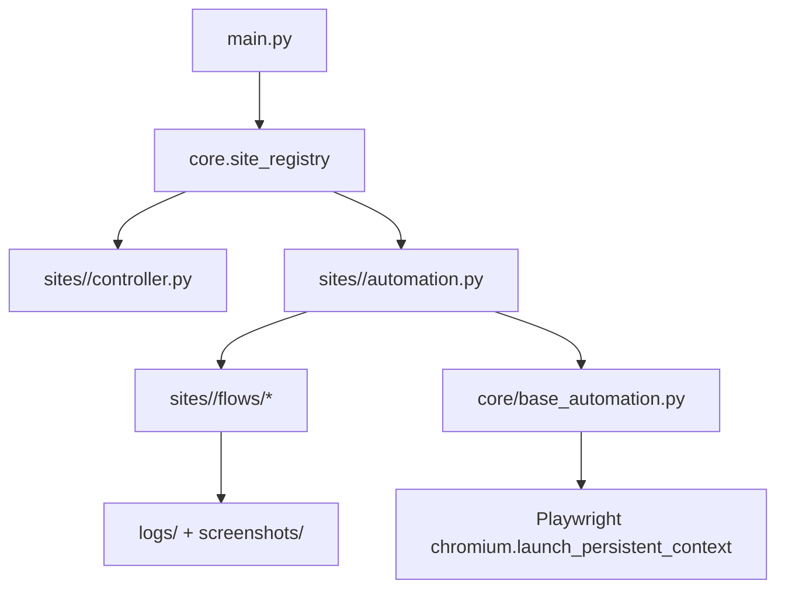

# Xaloc 2026 - Automatizacion web (Playwright + Python)

Herramienta de automatizacion basada en **Playwright (async)** con una arquitectura **multi-sitio**. El proyecto arranco automatizando Xaloc Girona (STA) y ha evolucionado para soportar distintos portales bajo un nucleo comun.

## Que hay hoy (estado actual)

Sitios registrados en `core/site_registry.py`:

- `xaloc_girona`: login con certificado (VALID), rellenado STA, adjuntos, confirmacion y screenshot final **sin pulsar "Enviar"**.
- `base_online`: login con certificado y ramificacion `P1`/`P2`/`P3` (rellena formularios + adjunta documentos), llega a pantalla "Signar i Presentar" **sin firmar/presentar**.
- `madrid`: navegacion completa hasta el formulario + rellenado del formulario (pantalla de adjuntos alcanzada); **upload/envio pendientes**.

## SQL Server (sync scripts)

Para `sync_sqlserver_to_worker_queue.py`, la conexion a SQL Server puede venir por variables de entorno (recomendado si tu parser de `.env` se come `;`):

- `SQLSERVER_DRIVER` (por defecto: `SQL Server`)
- `SQLSERVER_SERVER`
- `SQLSERVER_DATABASE`
- `SQLSERVER_USERNAME`
- `SQLSERVER_PASSWORD`
- (opcional) `SQLSERVER_TRUSTED_CONNECTION=1`

Alternativamente, puedes seguir usando `--connection-string` o `SQLSERVER_CONNECTION_STRING`.

## Documentación obligatoria del cliente (AUT + identidad)

El `worker.py` añade automáticamente la documentación del cliente a la lista de archivos a subir (para todos los sites). Busca los documentos en el servidor de documentación y, si es necesario, los sube como varios archivos o los fusiona en un único PDF.

Reglas (por defecto):

- Particular: `AUT` + (`DNI` o `NIE`)
- Empresa: `AUT` + (`CIF` o `NIF`) + (`DNI` o `NIE`)
  - `ESCR` es opcional (se puede forzar con `CLIENT_DOCS_REQUIRE_ESCR=1`)

Variables de entorno (opcionales):

- `REQUIRE_CLIENT_DOCS` (default `1`): `0/false` para desactivar.
- `CLIENT_DOCS_BASE_PATH` (default `\\SERVER-DOC\clientes`): raíz de la carpeta de clientes.
- `CLIENT_DOCS_MERGE` (default `1`): intenta fusionar varios documentos en un PDF.
- `PDFTK_PATH` (default `C:\Program Files (x86)\PDFtk\bin\pdftk.exe`): ruta a PDFtk (si no existe, sube por separado).
- `CLIENT_DOCS_OUTPUT_DIR` (default `tmp/client_docs`): salida de PDFs fusionados.
- `CLIENT_DOCS_REQUIRE_ESCR` (default `0`): fuerza exigir `ESCR` para empresas.

## Requisitos

- Python **3.10+** (se usan type hints `str | None`).
- Windows recomendado (Edge + políticas de autoselección de certificado).
- Playwright + navegador `msedge` (por defecto se lanza canal `msedge` con perfil persistente).

## Instalacion

```powershell
python -m venv venv
venv\Scripts\activate
pip install -r requirements.txt
python -m playwright install msedge
```

## Uso (CLI)

El entrypoint es `main.py`. Si no pasas `--site`, te pide uno por consola.

```powershell
# Modo interactivo (seleccion de site por prompt)
python main.py

# Ejecutar un site concreto
python main.py --site xaloc_girona
python main.py --site base_online --protocol P1
python main.py --site madrid

# Headless (flag; si no la pasas, abre navegador visible)
python main.py --site madrid --headless
```

Parametros especificos disponibles hoy en `main.py` (BASE On-line):

```powershell
# P1 / P2 adjuntos
python main.py --site base_online --protocol P1 --p1-file pdfs-prueba/test1.pdf
python main.py --site base_online --protocol P2 --p2-file pdfs-prueba/test1.pdf

# P3 (recurso reposicion)
python main.py --site base_online --protocol P3 `
  --p3-tipus-objecte IVTM `
  --p3-dades "1234-ABC" `
  --p3-tipus-solicitud 1 `
  --p3-exposo "Texto de exposicion" `
  --p3-solicito "Texto de solicitud" `
  --p3-file pdfs-prueba/test3.pdf
```

Nota: los datos de ejecución deben venir de la cola (SQLite) o de un JSON (p.ej. encolado con `enqueue_task.py`). Los controladores no generan datos "demo" ni aplican valores por defecto.

## Como funciona por dentro (arquitectura)



Piezas:

- `core/base_automation.py`: context manager async que abre Playwright con **perfil persistente** (`profiles/...`), configura timeouts, logging y captura screenshots de error.
- `core/base_config.py`: configuracion base (`BaseConfig`) + navegador (`BrowserConfig`) + `Timeouts`.
- `core/site_registry.py`: "router" de sitios. Resuelve `site_id -> Automation class` y `site_id -> Controller`.
- `sites/<site>/automation.py`: orquestador del flujo del sitio (fases) y manejo de errores/screenshot.
- `sites/<site>/flows/*.py`: pasos concretos del portal (login, navegacion, formulario, adjuntos...).
- `sites/<site>/data_models.py`: modelos de datos del tramite (lo que se rellena).
- `sites/<site>/config.py`: selectores/URLs/timeouts especificos del portal.

## Estructura de carpetas (lo importante)

```
core/                 # nucleo comun (base automation/config + registry)
sites/                # implementaciones por portal
  xaloc_girona/
  base_online/
  madrid/
flows/                # compat: redirige a sites/xaloc_girona/flows
utils/                # utilidades (p.ej. popup nativo de Windows)
explore-html/         # capturas/guias de reverse engineering por portal
pdfs-prueba/          # PDFs de prueba para adjuntos
profiles/             # perfiles persistentes del navegador (NO versionar)
logs/                 # logs por site
screenshots/          # evidencias (ok/error)
main.py               # CLI/entrypoint
```

## Certificado digital (puntos criticos)

- La autenticacion con certificado puede disparar un **popup nativo de Windows**. En modo worker se evita con políticas de Edge (`AutoSelectCertificateForUrls`).
- Se usa **perfil persistente** (`profiles/...`) para reutilizar estado del navegador.

## Artefactos: logs y screenshots

- Logs: `logs/<site_id>.log` (tambien salen por consola).
- Screenshots: `screenshots/`.
- Screenshot en error: cada `Automation` captura uno especifico (p.ej. `madrid_error.png`, `base_online_error.png`, etc.).

## Seguridad / modo "demo" (para no registrar tramites)

- `xaloc_girona`: el flujo llega a la pantalla final y guarda evidencia, pero **no pulsa "Enviar"** (ver `sites/xaloc_girona/flows/confirmacion.py`).
- `base_online`: el flujo llega a "Signar i Presentar", pero **no firma/presenta** (ver `sites/base_online/flows/p1.py`, `sites/base_online/flows/p2.py`, `sites/base_online/flows/reposicion.py`).
- `madrid`: el envio esta pendiente; hoy llega y rellena hasta la pantalla posterior al formulario.

## Anadir un nuevo sitio (guia rapida)

1. Crear `sites/<nuevo_site>/` con:
   - `config.py` (extiende `BaseConfig`)
   - `data_models.py`
   - `controller.py` con `get_controller()` y `site_id`
   - `automation.py` (extiende `BaseAutomation`)
   - `flows/` con los pasos
2. Registrar el sitio en `core/site_registry.py` (automation + controller paths).

## Documentacion de apoyo

- `explore-html/base-guide.md`: notas y flujo de BASE On-line.
- `explore-html/madrid-guide.md` y `explore-html/llenar formulario-madrid.md`: navegacion + campos del formulario de Madrid.
- `xaloc-documentation.md` y `xaloc-action-plan.md`: documentacion tecnica del portal Xaloc y plan de trabajo.

## Compatibilidad (imports antiguos)

Se mantienen wrappers para no romper scripts antiguos:

- `xaloc_automation.py`: expone `XalocAsync` apuntando a `sites/xaloc_girona/automation.py`.
- `config.py`: expone `Config` y `DatosMulta` apuntando a `sites/xaloc_girona/*`.
- `flows/*`: reexporta los flujos de `sites/xaloc_girona/flows/*`.

