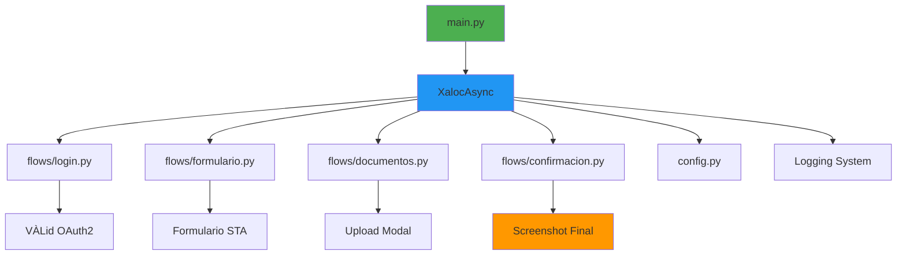
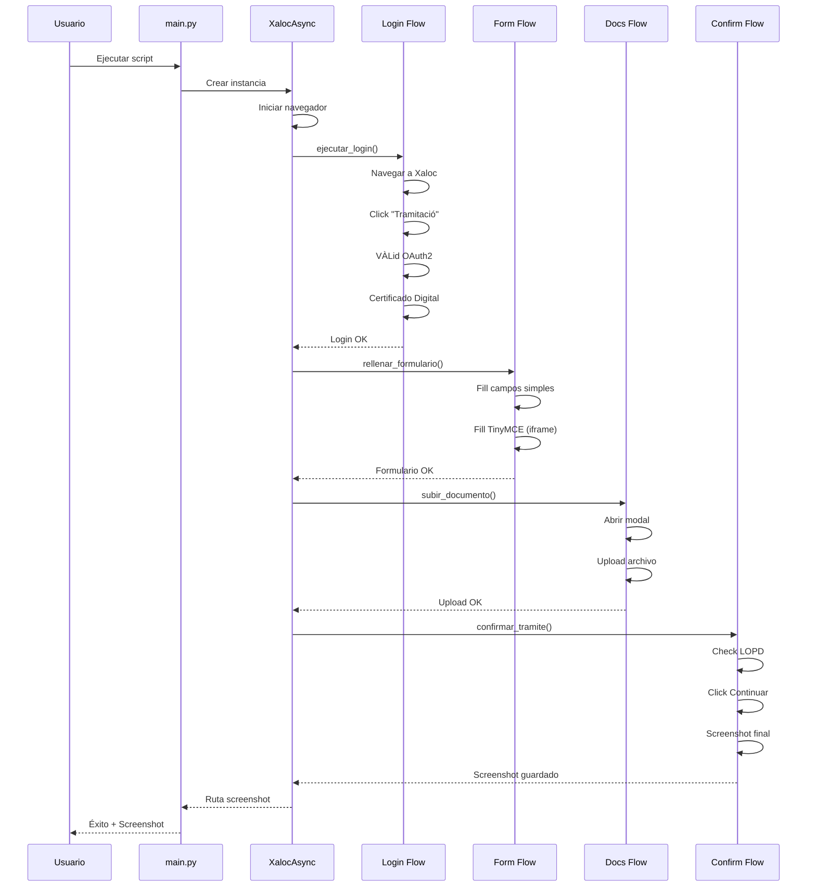

# 🤖 Xaloc Automation

Automatización del trámite de **alegaciones de multas** en la Sede Electrónica de Xaloc Girona utilizando **Playwright** con Python asíncrono.


---

## 📋 Tabla de Contenidos

- [Descripción](#-descripción)
- [Características](#-características)
- [Arquitectura](#-arquitectura)
- [Requisitos](#-requisitos)
- [Instalación](#-instalación)
- [Configuración](#-configuración)
- [Uso](#-uso)
- [Estructura del Proyecto](#-estructura-del-proyecto)
- [Flujo de Automatización](#-flujo-de-automatización)
- [Seguridad y Testing](#-seguridad-y-testing)
- [Troubleshooting](#-troubleshooting)
- [Roadmap](#-roadmap)
- [Contribuir](#-contribuir)

---

## 🎯 Descripción

Este proyecto automatiza el proceso completo de presentación de alegaciones de multas en el portal de **Xaloc Girona**, desde la autenticación con certificado digital hasta la confirmación final del trámite.

### ¿Qué hace?

1. **Autenticación automática** mediante VÀLid (AOC) con certificado digital
2. **Rellenado inteligente** del formulario STA con datos de la multa
3. **Subida de documentos** adjuntos (opcional)
4. **Captura de evidencias** mediante screenshots
5. **Modo testing** que NO envía datos reales al registro oficial

> [!WARNING]
> **Política de Testing:** El bot se detiene antes de pulsar el botón final "Enviar" para evitar crear registros oficiales durante las pruebas.

---

## ✨ Características

- ✅ **Autenticación VÀLid** con certificado digital persistente
- ✅ **Manejo de iframes** para editor TinyMCE
- ✅ **Gestión de archivos** adjuntos
- ✅ **Logging completo** de todas las operaciones
- ✅ **Screenshots automáticos** de éxito y errores
- ✅ **Timeouts configurables** adaptados a STA
- ✅ **Arquitectura modular** con flujos separados
- ✅ **Context manager** para gestión de recursos
- ✅ **Modo headless** opcional

---

## 🏗️ Arquitectura



### Componentes Principales

| Componente | Descripción |
|:-----------|:------------|
| **main.py** | Punto de entrada con datos de prueba |
| **xaloc_automation.py** | Orquestador principal con context manager |
| **config.py** | Configuración centralizada con dataclasses |
| **flows/** | Módulos de flujos de automatización |
| **flows/login.py** | Autenticación VÀLid + certificado |
| **flows/formulario.py** | Rellenado de campos STA |
| **flows/documentos.py** | Subida de archivos |
| **flows/confirmacion.py** | Confirmación y screenshot |

---

## 📦 Requisitos

### Software

- **Python 3.8+**
- **Microsoft Edge** (o Chromium)
- **Certificado Digital** instalado en el sistema

### Dependencias Python

```txt
playwright>=1.40.0
```

---

## 🚀 Instalación

### 1. Clonar el Repositorio

```bash
git clone https://github.com/tu-usuario/xaloc-automation.git
cd xaloc-automation
```

### 2. Crear Entorno Virtual

```bash
# Windows
python -m venv venv
venv\Scripts\activate

# Linux/Mac
python3 -m venv venv
source venv/bin/activate
```

### 3. Instalar Dependencias

```bash
pip install -r requirements.txt
playwright install msedge
```

### 4. Crear Estructura de Directorios

Los directorios se crean automáticamente al ejecutar, pero puedes crearlos manualmente:

```bash
mkdir profiles screenshots logs test_files
```

---

## ⚙️ Configuración

### Configuración del Certificado Digital

> [!IMPORTANT]
> **PASO CRÍTICO:** Debes configurar el certificado digital en el perfil persistente de Edge.

#### Opción 1: Configuración Manual (Recomendada)

1. Ejecuta el script una vez para crear el perfil:
   ```bash
   python main.py --site xaloc_girona
   ```

2. Cuando llegue a la pantalla de VÀLid, selecciona tu certificado manualmente

3. Edge recordará tu selección para futuras ejecuciones

#### Opción 2: Certificado Pre-configurado

Si ya tienes un perfil de Edge con el certificado configurado:

```python
# En config.py
@dataclass
class ConfigNavegador:
    perfil_path: Path = Path("ruta/a/tu/perfil/edge")
```

### Configuración de Datos de Prueba

Edita `main.py` para cambiar los datos de prueba:

```python
datos = DatosMulta(
    email="tu-email@example.com",
    num_denuncia="DEN/2024/001",
    matricula="1234ABC",
    num_expediente="EXP/2024/001",
    motivos="Tu texto de alegación aquí",
    archivo_adjunto=Path("test_files/tu_documento.pdf")  # Opcional
)
```

### Configuración de Timeouts

Si experimentas problemas de timeout, ajusta en `config.py`:

```python
@dataclass
class Timeouts:
    general: int = 30000        # 30 segundos
    login: int = 60000          # 60 segundos
    transicion: int = 30000     # 30 segundos
    subida_archivo: int = 60000 # 60 segundos
```

---

## 💻 Uso

### Ejecución Básica

```bash
python main.py --site xaloc_girona

### Selección de sitio y headless

```bash
python main.py --site xaloc_girona --headless
```
```

### Ejecución con Logging Detallado

El logging está activado por defecto. Los logs se guardan en:
- **Consola:** Salida estándar
- **Archivo:** `logs/xaloc_girona.log` (por sitio: `logs/<site_id>.log`)

### Modo Headless

Para ejecutar sin interfaz gráfica, edita `config.py`:

```python
@dataclass
class ConfigNavegador:
    headless: bool = True  # Cambiar a True
```

### Ejemplo de Salida

```
============================================================
🚀 XALOC AUTOMATION - TRAMITACIÓN DE ALEGACIONES
============================================================

2024-01-14 14:00:00 - INFO - 🚀 Iniciando navegador...
2024-01-14 14:00:02 - INFO - ✅ Navegador iniciado

==================================================
FASE 1: AUTENTICACIÓN
==================================================
2024-01-14 14:00:03 - INFO - 🌐 Navegando a https://www.xalocgirona.cat/...
2024-01-14 14:00:05 - INFO - 🔗 Buscando enlace 'Tramitació en línia'
2024-01-14 14:00:07 - INFO - ⏳ Esperando pasarela VÀLid...
2024-01-14 14:00:10 - INFO - 🔐 Seleccionando certificado digital
2024-01-14 14:00:15 - INFO - ✅ Login completado - Formulario STA cargado

==================================================
FASE 2: RELLENADO DE FORMULARIO
==================================================
2024-01-14 14:00:16 - INFO - 📝 Rellenando formulario de alegación
2024-01-14 14:00:17 - INFO -   → Email: test@example.com
2024-01-14 14:00:18 - INFO -   → Nº Denuncia: DEN/2024/001
...

============================================================
✅ PROCESO FINALIZADO CON ÉXITO
============================================================

📸 Screenshot final: screenshots/xaloc_final_20240114_140030.png

⚠️  NOTA: El botón 'Enviar' NO fue pulsado (modo testing)
```

---

## 📁 Estructura del Proyecto

```
xaloc2026-main/
core/                        # Núcleo reusable (Playwright + config base + registry)
sites/                       # Un paquete por sitio (flujos independientes)
  xaloc_girona/              # Implementación actual migrada
(legacy) config.py, flows/, xaloc_automation.py  # Compat: re-export al sitio
├── main.py                      # Punto de entrada
├── config.py                    # Configuración y dataclasses
├── xaloc_automation.py          # Orquestador principal
├── requirements.txt             # Dependencias Python
│
├── flows/                       # Flujos de automatización
│   ├── __init__.py
│   ├── login.py                 # Autenticación VÀLid
│   ├── formulario.py            # Rellenado campos STA
│   ├── documentos.py            # Subida de archivos
│   └── confirmacion.py          # Pantalla final
│
├── profiles/                    # Perfiles navegador
│   └── edge_xaloc/              # Perfil con certificado
│
├── screenshots/                 # Capturas de pantalla
├── logs/                        # Logs de ejecución
├── test_files/                  # Archivos de prueba
│
├── xaloc-documentation.md       # Análisis técnico completo
├── xaloc-action-plan.md         # Plan de acción detallado
└── README.md                    # Este archivo
```

---

## 🔄 Flujo de Automatización

### Diagrama de Secuencia



### Fases del Proceso

| Fase | Descripción | Tiempo Aprox. |
|:----:|:------------|:--------------|
| **0** | Inicialización del navegador | 2-3 seg |
| **1** | Autenticación VÀLid + Certificado | 10-15 seg |
| **2** | Rellenado del formulario STA | 5-8 seg |
| **3** | Subida de documentos (opcional) | 3-5 seg |
| **4** | Confirmación y screenshot | 5-10 seg |
| **TOTAL** | | **25-40 seg** |

---

## 🔒 Seguridad y Testing

### Política de Testing

> [!CAUTION]
> **IMPORTANTE:** El bot está configurado para NO enviar datos reales al registro oficial.

El flujo se detiene en la pantalla de revisión final (`TramitaSign`) y captura un screenshot como evidencia, pero **NO pulsa el botón "Enviar"**.

### Datos Sensibles

- ✅ El certificado digital se almacena en el perfil persistente de Edge
- ✅ Los datos de prueba están en `main.py` (no en control de versiones)
- ✅ Los logs pueden contener información sensible (revisar antes de compartir)

### Recomendaciones

1. **No versionar** el directorio `profiles/` (contiene certificado)
2. **No compartir** screenshots con datos reales
3. **Revisar logs** antes de compartir con terceros
4. **Usar datos ficticios** para testing

---

## 🛠️ Troubleshooting

### Problema: Timeout en VÀLid

**Síntoma:** Error `TimeoutError` al esperar `valid.aoc.cat`

**Solución:**
```python
# En config.py, aumentar timeout de login
@dataclass
class Timeouts:
    login: int = 90000  # 90 segundos
```

### Problema: Certificado no seleccionado

**Síntoma:** El popup de certificado no se cierra automáticamente

**Solución:**
1. Eliminar el directorio `profiles/edge_xaloc/`
2. Ejecutar de nuevo y seleccionar certificado manualmente
3. Marcar "Recordar mi elección"

### Problema: Campo TinyMCE no se rellena

**Síntoma:** El campo "Motivos" queda vacío

**Solución:**
```python
# Verificar que el iframe está cargado
await page.wait_for_selector("#DinVarMOTIUS_ifr", state="attached")
editor = page.frame_locator("#DinVarMOTIUS_ifr")
await editor.locator("body#tinymce").fill(datos.motivos)
```

### Problema: Botón "Continuar" no visible

**Síntoma:** Error al hacer click en `div#botoncontinuar`

**Solución:**
```python
# Asegurarse de marcar el checkbox LOPD primero
await page.locator("#lopdok").check()
await page.wait_for_selector("div#botoncontinuar", state="visible", timeout=10000)
```

### Problema: Error de encoding en Windows

**Síntoma:** Caracteres extraños en la consola

**Solución:**
```python
# Ya incluido en main.py
if sys.platform == "win32":
    sys.stdout.reconfigure(encoding='utf-8')
```

---

## 🗺️ Roadmap

### MVP (Actual) ✅

- [x] Autenticación VÀLid
- [x] Rellenado de formulario
- [x] Subida de documentos
- [x] Screenshots de evidencia
- [x] Logging completo

### Fase 2 (Próximamente)

- [ ] Validadores de UI (`validators.py`)
- [ ] Manejo avanzado de errores (`error_handler.py`)
- [ ] Reintentos automáticos
- [ ] Notificaciones por email
- [ ] Dashboard de ejecuciones

### Fase 3 (Futuro)

- [ ] Interfaz gráfica (GUI)
- [ ] Procesamiento por lotes
- [ ] Integración con bases de datos
- [ ] API REST
- [ ] Dockerización

---

## 🤝 Contribuir

Las contribuciones son bienvenidas. Por favor:

1. Fork el proyecto
2. Crea una rama para tu feature (`git checkout -b feature/AmazingFeature`)
3. Commit tus cambios (`git commit -m 'Add some AmazingFeature'`)
4. Push a la rama (`git push origin feature/AmazingFeature`)
5. Abre un Pull Request

---

## 📄 Licencia

Este proyecto está bajo la Licencia MIT. Ver archivo `LICENSE` para más detalles.

---

## 📞 Contacto

Para preguntas o soporte, por favor abre un issue en GitHub.

---

## 🙏 Agradecimientos

- **AOC (Administració Oberta de Catalunya)** por la plataforma VÀLid
- **Xaloc Girona** por el sistema STA
- **Playwright Team** por la excelente herramienta de automatización

---

## 📚 Documentación Adicional

- [xaloc-documentation.md](xaloc-documentation.md) - Análisis técnico completo del portal
- [xaloc-action-plan.md](xaloc-action-plan.md) - Plan de acción detallado del proyecto

---

**Desarrollado con ❤️ para automatizar trámites administrativos**
