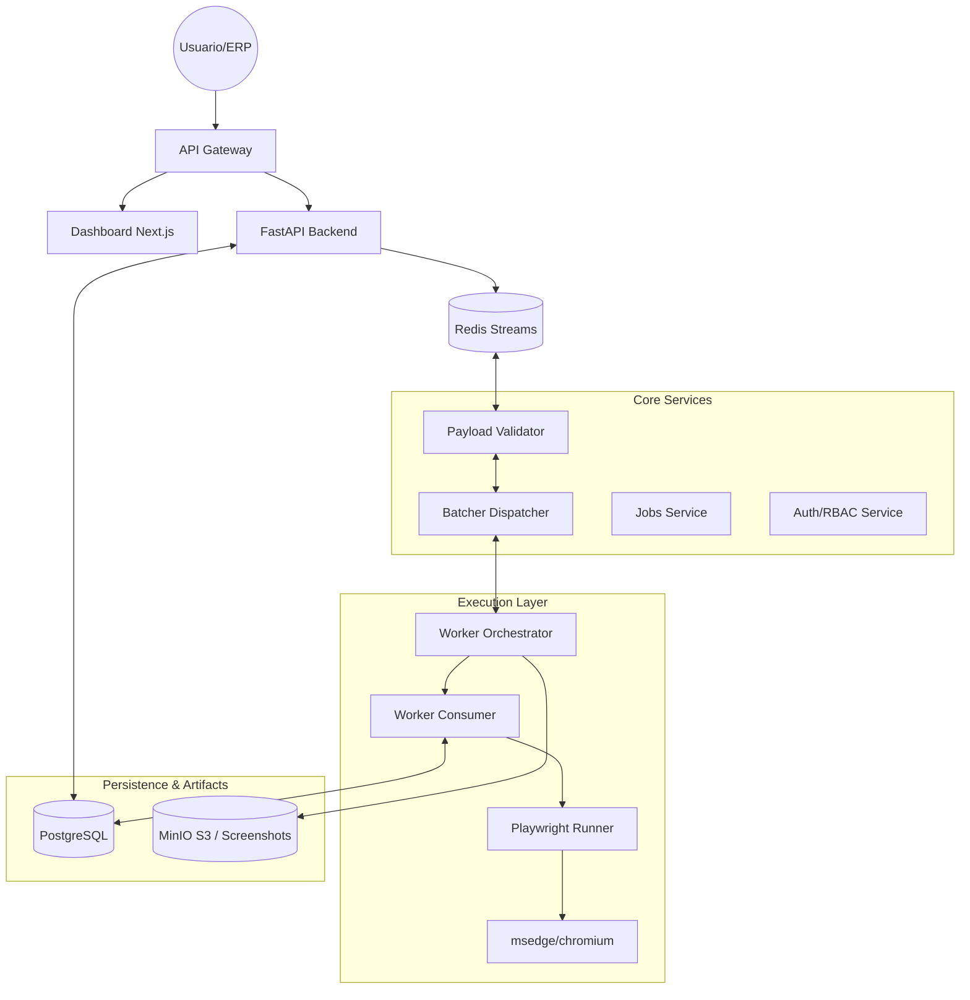

# Xaloc 2026 - Plataforma de Automatización Distribuida (v2.0)

Xaloc es una plataforma de automatización de trámites administrativos basada en **Playwright** y **Python**, diseñada para operar a escala mediante una arquitectura de **microservicios distribuidos**. Evolucionada desde una herramienta CLI simple, la versión 2.0 ofrece un ecosistema completo con dashboard en tiempo real, validación de payloads y orquestación inteligente de tareas.

## 🏗️ Arquitectura del Sistema

La plataforma se compone de múltiples servicios especializados que interactúan mediante **Redis Streams** y **PostgreSQL**.


```mermaid
flowchart TB
    User((Usuario/ERP)) --> Gateway[API Gateway]
    Gateway --> Frontend[Dashboard Next.js]
    Gateway --> Backend[FastAPI Backend]
    
    subgraph "Core Services"
        Validator[Payload Validator]
        Dispatcher[Batcher Dispatcher]
        Jobs[Jobs Service]
        Auth[Auth/RBAC Service]
    end
    
    Backend --> Redis[(Redis Streams)]
    Redis <--> Validator
    Validator <--> Dispatcher
    Dispatcher <--> Orchestrator[Worker Orchestrator]
    
    subgraph "Execution Layer"
        Orchestrator --> Worker[Worker Consumer]
        Worker --> Runner[Playwright Runner]
        Runner --> Browser[msedge/chromium]
    end
    
    subgraph "Persistence & Artifacts"
        Postgres[(PostgreSQL)]
        MinIO[(MinIO S3 / Screenshots)]
    end
    
    Worker <--> Postgres
    Backend <--> Postgres
    Orchestrator --> MinIO
```

---

## 🌐 Portales Soportados (Multi-site)

Xaloc utiliza un registro dinámico de automatizaciones en `core/site_registry.py`. Actualmente soporta:

1.  **Xaloc Girona**: Tramitación completa de expedientes (STA).
2.  **BASE On-line**: Protocolos P1, P2 y P3 (Recursos de reposición).
3.  **Sede Madrid**: Presentación con formulario y adjuntos.
4.  **Ayuntamiento de Palma**: Integración especializada con firma nativa.
5.  **RedSara**: Registro electrónico general.
6.  **Terrassa**: Portal ciudadano del Ayuntamiento de Terrassa.
7.  **Valencia**: Sede electrónica del Ayuntamiento de Valencia.
8.  **ATC**: Agència Tributària de Catalunya.
9.  **Diputació de Barcelona**: Tramitaciones provinciales.
10. **Servei Català de Tránsito**: Procesamiento de sanciones y alegaciones.

---

## 🚀 Guía de Inicio Rápido

### Despliegue con Docker (Recomendado)

La forma más rápida de levantar la plataforma completa (DBs, Redis, Dashboard y Servicios) es mediante Docker Compose:

```bash
# Navegar a la carpeta de infraestructura
cd infra/docker

# Levantar microservicios
docker-compose --file docker-compose.microservices.yml up -d
```

### Configuración Local (Desarrollo)

Si prefieres ejecutar los componentes manualmente para desarrollo:

1.  **Entorno Virtual**:
    ```powershell
    python -m venv venv
    venv\Scripts\activate
    pip install -r requirements.txt
    ```

2.  **Variables de Entorno**:
    Copia el `.env.example` a `.env` y configura las credenciales de XVIA y bases de datos.

3.  **Lanzar Dashboard API**:
    ```bash
    python dashboard_api.py
    ```

---

## 🛠️ Uso y Modos de Ejecución

### 1. Modo Plataforma (Automatizado)
El sistema escucha automáticamente las colas de Redis. El `worker.py` consume los jobs y utiliza el `Orchestrator` para ejecutar los flujos en el `Playwright Runner`.

### 2. Modo CLI (Testing / Debug)
Para pruebas rápidas de un flujo específico, puedes usar el entrypoint `main.py`:

```powershell
# Ejecutar un sitio concreto de forma interactiva
python main.py --site redsara

# Ejecutar con un protocolo específico y adjuntos
python main.py --site base_online --protocol P1 --p1-file ruta/al/archivo.pdf
```

### 3. Dashboard Web
Accede a `http://localhost:3000` (o el puerto configurado) para:
- Monitorizar el estado de los workers en tiempo real.
- Gestionar la lista negra de recursos bloqueados.
- Aprobar o rechazar autorizaciones pendientes.
- Visualizar evidencias (screenshots) de ejecuciones fallidas.

---

## 📁 Estructura del Proyecto

*   `core/`: Núcleo común, lógica de colas, persistencia y base de automatización.
*   `sites/`: Implementaciones específicas por portal (flows, configs, data models).
*   `services/`: Microservicios especializados (Auth, Jobs, Signing, etc.).
*   `dashboard-frontend/`: Aplicación Next.js para el control operativo.
*   `infra/`: Configuraciones de Docker, Caddy y scripts de sistema.
*   `logs/` & `screenshots/`: Trazabilidad y evidencias de ejecución.

---

## 🔐 Seguridad y Certificados

- **Certificados Digitales**: Soportados mediante perfiles persistentes y políticas de autoselección en Edge/Chromium.
- **AutoSelectCertificateForUrls**: En entornos Windows/Worker, se configuran políticas de registro para evitar popups nativos.
- **RBAC**: El acceso al dashboard está protegido por un servicio de autenticación con roles diferenciados (Operador / Admin).

---

## 📄 Documentación Adicional

- `AGENTS.md`: Guía para el desarrollo con agentes IA (Claude Flow).
- `SECURITY_AND_ACCESS_CONTROL.md`: Detalles sobre la seguridad de la plataforma.
- `docs/`: Documentación técnica detallada de flujos específicos.

---
Ante cualquier push, habrá autodeploy en la rama main. Se conecta al 130 de proxmox con ssh y dentro se puede usar morrigan como usuario y morrigan como contraseña


