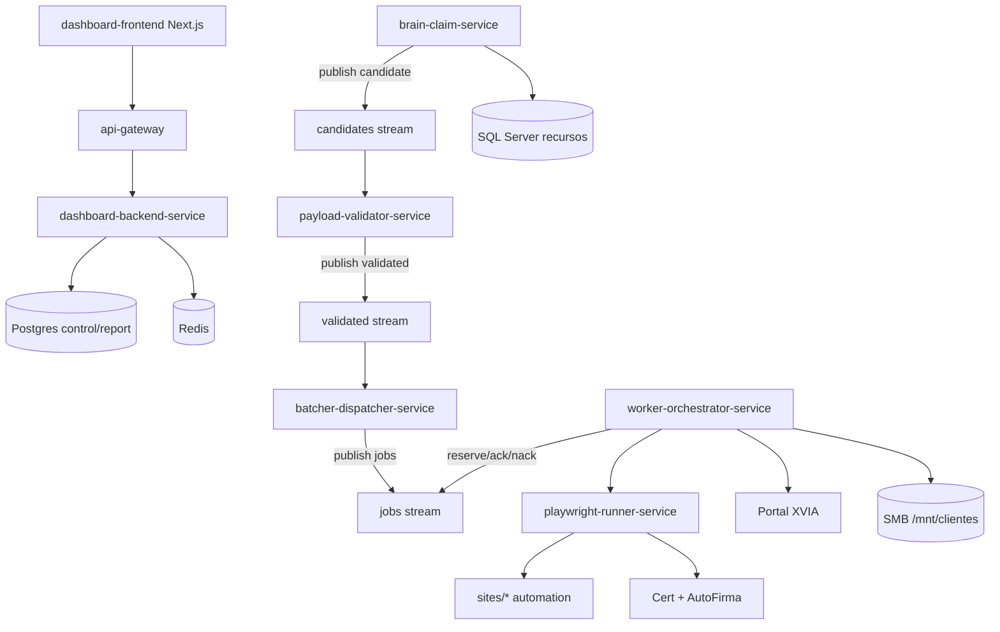

# 01 - Arquitectura General

## Objetivo
Explicar la arquitectura global del sistema, separando frontend, backend de servicios, orquestacion brain/worker y pipeline de ejecucion Playwright.

## Flujo extremo a extremo


## Estructura por dominios
- `dashboard-frontend/`: UI operativa y admin (Next.js app router).
- `dashboard_api.py` + `services/dashboard_backend/`: API principal para UI, realtime y control.
- `services/brain_claim/`: adquisicion/claim de recursos en XVIA + publicacion a `candidates`.
- `services/payload_validator/`: normalizacion payload, reglas GESDOC, incidencias, paso a `validated`.
- `services/batcher_dispatcher/`: consolidacion de `validated` y despacho a `jobs`.
- `services/worker_orchestrator/` + `core/worker/`: consumo de `jobs`, ejecucion, retries y cierre.
- `services/playwright_runner/`: endpoint `/execute` para correr automation Playwright por site.
- `sites/`: automatizaciones por organismo (`madrid`, `xaloc_girona`, `base_online`, `ayunta_palma`, `redsara`, `terrassa`, `valencia`, `atc`, `diputacio_bcn`).
- `core/`: contratos transversales (queue gateway, xvia auth, paths de cliente, storage de justificantes, runtime stores).

## Puntos criticos
- El backend logico es una mezcla de API monolitica (`dashboard_api.py`) y microservicios especializados.
- El "brain" actual es claim-only: no ejecuta tramites, solo prepara candidatos y payloads.
- El "worker" es quien materializa el tramite y decide ACK/NACK/release/deselect.
- Las reglas de negocio (expediente valido, organismo objetivo, descartos) viven mayoritariamente en `sites/adapters/*.py`.
- Postgres actua como plano de control (estado jobs, blacklist, incidencias, configuracion activa de organismos).

## Interfaces publicas relevantes
- UI consume `/api/*` via `api-gateway`.
- Runner expone `/health` y `/execute`.
- Auth RBAC expone `/auth/*` (proxied por dashboard API/gateway).
- Jobs service expone `/jobs` para operaciones de control plane.

## Comandos utiles
```powershell
# Ver arbol de servicios
Get-ChildItem services -Directory

# Ver sites registrados
Get-Content core/site_registry.py

# Ver topologia de compose
Get-Content infra/docker/docker-compose.microservices.yml
```

## Checklist operativo
- [ ] Existe conectividad entre `brain -> validator -> batcher -> worker` via Redis.
- [ ] `api-gateway` enruta frontend y backend sin CORS bloqueante.
- [ ] `playwright-runner-service` esta sano antes de arrancar worker.
- [ ] `organismo_config` activa solo sites realmente soportados.
