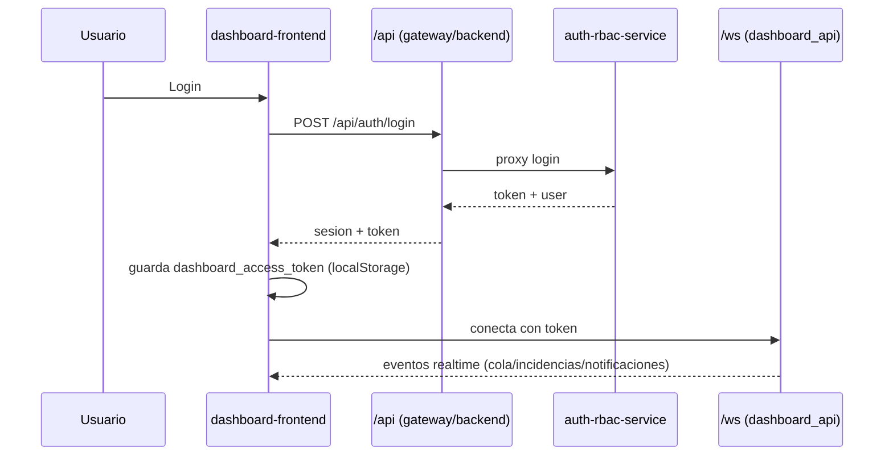

# 02 - Frontend Dashboard

## Objetivo
Documentar la estructura del frontend (`dashboard-frontend`) y su contrato con backend para operacion diaria, control y soporte.

## Flujo de sesion


## Estructura principal
- `dashboard-frontend/app/`: rutas de pagina (app router).
- `dashboard-frontend/components/`: shell, navbar, widgets.
- `dashboard-frontend/lib/api.ts`: cliente HTTP tipado para `/api/*`.
- `dashboard-frontend/lib/AuthContext.tsx`: estado de autenticacion.
- `dashboard-frontend/lib/WebSocketContext.tsx`: canal realtime.
- `dashboard-frontend/lib/types.ts`: tipos de datos UI (cola, incidencias, config, usuarios).

## Rutas operativas
- `/`: estado general.
- `/gestion`: gestion de colas, pausas, activacion de site, claim limits.
- `/history`: historial de incidencias/success y top usuarios.
- `/incidents`: cola de incidencias pendientes.
- `/blacklist`: recursos bloqueados y desbloqueo.
- `/documentos`: utilidades documentales.
- `/descargas`: notificaciones/broadcast y utilidades Electron.
- `/users`: gestion de usuarios (admin).
- `/control`: control de procesos (admin).
- `/login`: acceso.

## Llamadas API relevantes (frontend)
- `queueApi`: `/queue/current`, `/queue/pauses/*`, `/queue/recover-stuck`.
- `historyApi`: `/history/incidents`, `/history/successes`, `/history/days`.
- `incidentsApi`: `/incidents`, `/incidents/{id}/claim`, `/incidents/{id}/release`.
- `blacklistApi`: `/blacklist`, `/blacklist/{site_id}/{resource_id}`.
- `configApi`: `/config`, `/config/{site_id}`, `/config/{site_id}/active`.
- `sessionApi`: `/auth/login`, `/auth/me`, `/auth/logout`.
- `usersApi`: `/auth/users` CRUD.

## Puntos criticos
- `AppShell` bloquea rutas protegidas si no hay sesion valida.
- El websocket usa token en query/header/cookie segun disponibilidad.
- `KNOWN_SITES` en `/gestion` condiciona visibilidad/orden base de sites en UI.
- El frontend no debe asumir estados finales de negocio; solo representa backend.

## Comandos utiles
```powershell
# Frontend local
cd dashboard-frontend
npm install
npm run dev

# Build produccion frontend
npm run build
npm run start
```

## Checklist operativo
- [ ] Login y logout funcionales.
- [ ] WebSocket conecta y recibe eventos (`incidents`, `alerts`, `queue updates`).
- [ ] Paginas de `incidents` y `blacklist` reflejan acciones backend.
- [ ] `/gestion` permite pausar/reanudar y activar/desactivar sites segun rol.
