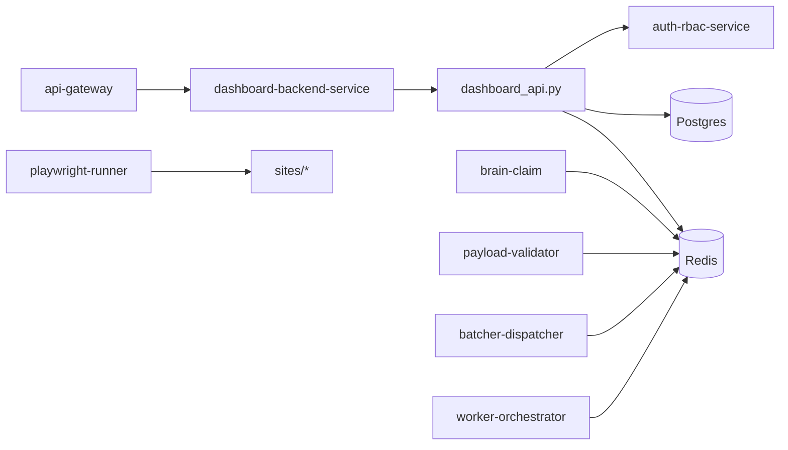

# 03 - Backend y Servicios

## Objetivo
Explicar el backend por capas: API de dashboard, microservicios de pipeline y servicios auxiliares.

## Flujo backend


## Servicios en `services/`
- `api_gateway`: gateway para frontend + proxy backend + websocket proxy.
- `auth_rbac`: autenticacion/autorizacion dashboard (JWT + usuarios).
- `dashboard_backend`: empaqueta `dashboard_api` y endpoints admin extra.
- `brain_claim`: selecciona/claim recursos en XVIA y publica `candidates`.
- `payload_validator`: valida payload y publica `validated` o DLQ.
- `batcher_dispatcher`: convierte `validated` en `jobs` con dedupe en PG.
- `worker_orchestrator`: loop worker de consumo/ejecucion.
- `playwright_runner`: ejecuta automatizaciones Playwright via HTTP.
- `jobs`: API para estado/transiciones de jobs en control plane.
- `signing`: servicio dedicado a firma/crypto segun integracion.

## API dashboard (resumen funcional)
- Auth y usuarios: `/api/auth/*`.
- Cola runtime: `/api/queue/*`.
- Incidencias: `/api/incidents*`, `/api/history/incidents`.
- Blacklist: `/api/blacklist*`.
- Config de organismos/sites: `/api/config*`.
- Control de procesos/logs: `/api/control/*`, `/api/logs/*`.
- Notificaciones admin: `/api/admin/notifications/*`.
- Utilidades docs cliente: `/api/client-folder`.

## Almacenamiento por responsabilidad
- Redis: streams, pub/sub UI, locks/dedupe transitorios.
- Postgres: control plane (`jobs`, `job_drafts`, runtime, blacklist, organismo_config, realtime_*).
- SQL Server: fuente de recursos y datos de expediente/cliente para payload.
- SMB (`/mnt/clientes`): destino de justificantes y documentacion cliente.

## Puntos criticos
- No mezclar errores de API (control) con errores de pipeline (cola/worker).
- Cualquier cambio de schema operativo debe reflejarse en servicios que leen/escriben PG.
- `dashboard_backend` y `dashboard_api` comparten proceso y deben mantenerse coherentes en rutas.
- El gateway maneja CORS y cookies/tokens para Electron y web.

## Comandos utiles
```powershell
# Salud basica de APIs
curl http://localhost:8080/health
curl http://localhost:8788/health
curl http://localhost:8101/health
curl http://localhost:8111/health

# Inspeccion rutas dashboard
rg -n "@app\\.(get|post|put|delete)\\(" dashboard_api.py services/dashboard_backend/app.py
```

## Checklist operativo
- [ ] `api-gateway` responde y enruta frontend/backend.
- [ ] `dashboard-backend-service` conectado a Redis y Postgres.
- [ ] `auth-rbac-service` operativo antes de usar UI.
- [ ] Servicios de pipeline levantados sin loops de reinicio.
