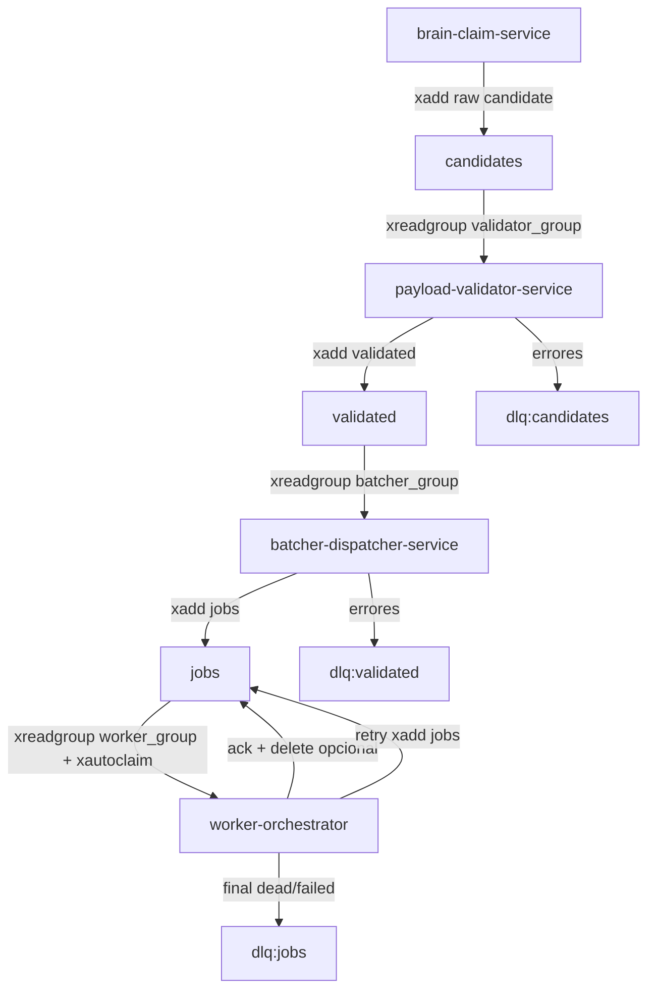

# 04 - Brain, Worker y Colas

## Objetivo
Describir como el sistema reclama recursos, valida payloads, despacha jobs y ejecuta tramites usando Redis Streams y control plane en Postgres.

## Pipeline de colas


## Brain (claim-only)
- Carga `organismo_config` activos.
- Consulta SQL Server via `ResourceRepository` y adapters (`sites/adapters/*`).
- Aplica validacion de procesabilidad (`processable_validator`).
- Rechaza bloqueados/pausados/activos en cola.
- Reclama recurso en XVIA (`/telematicos/Asignado`) y verifica en SQL.
- Publica `raw_payload` en stream `candidates`.

## Validator
- Consume `candidates` con consumer group.
- Normaliza payload (incluyendo canonical if present).
- Evalua requisitos GESDOC y puede generar incidencias + recheck diferido.
- Persiste draft en PG (`job_drafts`) y publica `validated`.
- En error duro: publica `dlq:candidates`.

## Batcher/Dispatcher
- Consume `validated`, ordena por prioridad/fecpres en ventana temporal.
- Ejecuta dedupe activo sobre PG (`jobs`/`job_drafts`).
- Publica jobs ejecutables en stream `jobs`.
- En error: mueve a `dlq:validated`.

## Worker
- Reserva jobs con `xreadgroup` y recupera atascados con `xautoclaim`.
- Evalua pausas por site/recurso antes de ejecutar.
- Ejecuta tramite (runner remoto o local).
- `ack` en exito; `nack` retryable con requeue; `release` para paradas manuales.
- En fallo final/no-retry: puede deseleccionar recurso en XVIA y bloquear en blacklist.

## Estados clave
- Cola stream: pendiente/processing implicito por PEL + ledger PG.
- Ledger job: `queued`, `processing`, `completed`, `failed`, `dead`, `cancelled`, `succeeded`.
- Incidencias: `NEW`, `REVIEWED`, `RESOLVED`.

## Puntos criticos
- `QUEUE_STREAM_GROUP_START_ID=0-0` evita perder entradas previas en recreacion de grupo.
- Dedupe existe en dos capas: redis key temporal y PG (dedup key + recurso activo).
- `QUEUE_STREAM_PENDING_CLAIM_MIN_IDLE_MS` controla recuperacion de jobs "huerfanos".
- Un `release` no aumenta intentos; un `nack` retryable si.

## Comandos utiles
```powershell
# Ver streams (requiere redis-cli en contenedor)
docker exec -it xaloc-redis redis-cli XINFO STREAM candidates
docker exec -it xaloc-redis redis-cli XINFO STREAM validated
docker exec -it xaloc-redis redis-cli XINFO STREAM jobs

# Ver consumer groups
docker exec -it xaloc-redis redis-cli XINFO GROUPS candidates
docker exec -it xaloc-redis redis-cli XINFO GROUPS validated
docker exec -it xaloc-redis redis-cli XINFO GROUPS jobs
```

## Checklist operativo
- [ ] `brain` publica candidatos y no se queda en error continuo.
- [ ] `payload-validator` consume y produce `validated`.
- [ ] `batcher-dispatcher` llena `jobs`.
- [ ] `worker` consume `jobs` y ackea/nackea correctamente.
- [ ] DLQ solo crece ante errores reales investigados.
