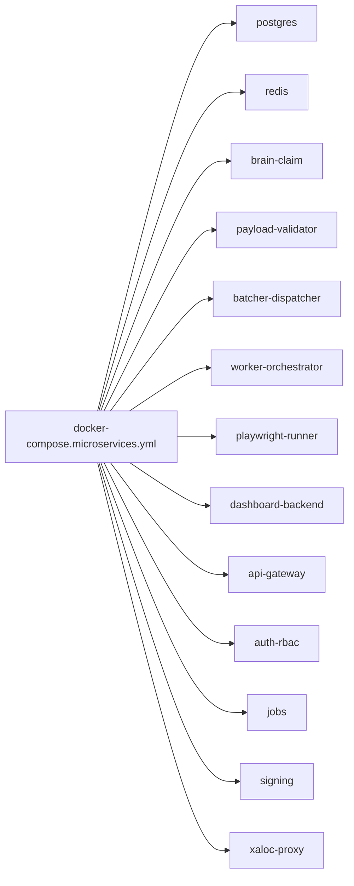

# 05 - Docker y Despliegue

## Objetivo
Documentar como se ejecuta todo el sistema en Docker Compose, con dependencias, variables criticas y diagnostico de arranque.

## Flujo de despliegue


## Servicios y dependencias relevantes
- Base datos:
  - `postgres` (control plane/reporting).
  - `redis` (streams + pubsub + dedupe).
- Pipeline:
  - `brain-claim-service`, `payload-validator-service`, `batcher-dispatcher-service`, `worker-orchestrator-service`.
- Ejecucion browser:
  - `playwright-runner-service` (VNC/noVNC, certs, AutoFirma handler).
- Dashboard:
  - `dashboard-backend-service`, `api-gateway`, `auth-rbac-service`.
- Auxiliares:
  - `jobs-service`, `signing-service`, `xaloc-proxy`, `autoheal`.

## Volumenes importantes
- `postgres_data`, `redis_data`, `artifacts_data`.
- `clientes_smb` montado en `/mnt/clientes` (documentacion/justificantes).
- `dptos_smb` montado en `/mnt/dptos`.
- Frontend cache/build en `dashboard_frontend_node_modules` y `.next`.

## Variables criticas (ejemplos)
- Cola/runtime:
  - `QUEUE_MODE=redis_streams`, `REDIS_URL`, `QUEUE_STREAM_*`.
- Certificados:
  - `PLAYWRIGHT_CERT_PATH`, `PLAYWRIGHT_CERT_PASSWORD`, `PLAYWRIGHT_CLIENT_CERT_ORIGINS`.
- AutoFirma:
  - `XALOC_AUTOFIRMA_ORIGIN`, `XALOC_AUTOFIRMA_ALLOWED_ORIGINS`, `XALOC_AUTOFIRMA_PROTOCOLS`.
- XVIA auth worker:
  - `XVIA_EMAIL`, `XVIA_PASSWORD`.
- Postgres:
  - `REPORT_PG_DSN`.

## Arranque y parada
```powershell
# Arranque completo
docker compose --env-file .env -f infra/docker/docker-compose.microservices.yml up -d --build

# Arranque focalizado pipeline + runner
docker compose --env-file .env -f infra/docker/docker-compose.microservices.yml up -d --build brain-claim-service payload-validator-service batcher-dispatcher-service worker-orchestrator-service playwright-runner-service

# Parada ordenada
docker compose -f infra/docker/docker-compose.microservices.yml down
```

## Diagnostico basico
```powershell
# Estado contenedores
docker compose -f infra/docker/docker-compose.microservices.yml ps

# Logs key path
docker compose --env-file .env -f infra/docker/docker-compose.microservices.yml logs -f --tail=200 brain-claim-service worker-orchestrator-service playwright-runner-service

# Compose renderizado (detectar env vacio)
docker compose --env-file .env -f infra/docker/docker-compose.microservices.yml config
```

## Puntos criticos
- Si falta `.env` en arranque, certificados/password pueden quedar vacios y romper firma.
- `playwright-runner-service` debe estar sano antes de consumo worker.
- Montajes SMB deben estar accesibles para guardar justificantes.
- Evitar credenciales hardcoded en compose para entornos reales; usar secretos/vars.

## Checklist operativo
- [ ] Todos los servicios `healthy` o `running` sin restart loop.
- [ ] Redis y Postgres accesibles desde servicios app.
- [ ] Runner expone `8111` y responde `/health`.
- [ ] API gateway responde `8080/health`.
- [ ] Worker no arranca sin credenciales XVIA validas.
