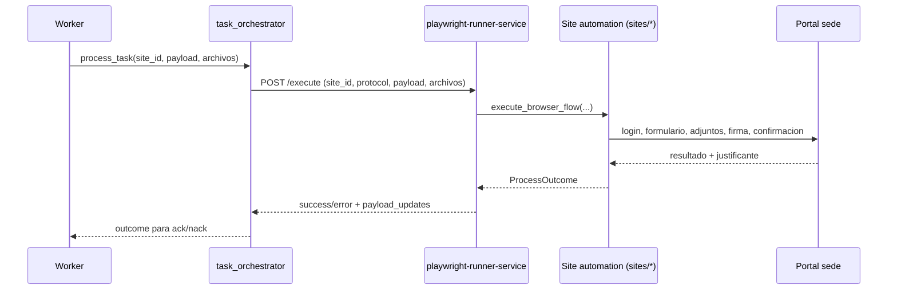

# 06 - Bots Playwright

## Objetivo
Explicar como se ejecutan los bots Playwright por sitio, desde el worker hasta los flujos `sites/*`, incluyendo runner remoto y manejo de artefactos.

## Flujo de ejecucion


## Componentes clave
- Registro de sites: `core/site_registry.py`.
- Ejecutor: `core/worker_execution/browser_executor.py`.
- Runner HTTP: `services/playwright_runner/app.py`.
- Orquestador de tarea: `core/worker_execution/task_orchestrator.py`.
- Automatizaciones por organismo: `sites/<site_id>/automation.py` + `flows/*.py`.

## Patron por site
Cada site suele tener:
- `config.py`: urls, selectores, timeouts.
- `data_models.py`: datos del tramite.
- `controller.py`: transformacion payload -> modelo del site.
- `automation.py`: secuencia principal.
- `flows/*.py`: pasos concretos (login, formulario, adjuntos, firma, confirmacion).

## Modo local vs runner remoto
- Remoto (default en compose): worker llama a runner (`USE_PLAYWRIGHT_RUNNER_SERVICE=1`).
- Local: `execute_browser_flow` directo sin servicio runner.

## Gestion de entradas y archivos
- Runner soporta:
  - `archivos`: paths ya existentes.
  - `archivo_blobs`: contenido base64 que se materializa en tmp.
- Antes de ejecutar valida existencia de ficheros y falla temprano si falta input.

## Puntos criticos
- El runner serializa ejecucion via lock global (`_EXECUTE_LOCK`), evita colisiones de browser/profile.
- Perfiles persistentes y certificado deben estar listos antes del login de sede.
- El `payload_updates` es contrato critico para que worker sepa si hubo justificante, numero de registro, etc.
- En sites sensibles, no se debe marcar completado XVIA si no hay evidencia de cierre real (segun flags por site).

## Comandos utiles
```powershell
# Health runner
curl http://localhost:8111/health

# Logs runner en vivo
docker compose --env-file .env -f infra/docker/docker-compose.microservices.yml logs -f --tail=200 playwright-runner-service

# Ver sites disponibles
python - <<'PY'
from core.site_registry import list_sites
print(list_sites())
PY
```

## Checklist operativo
- [ ] Site registrado en `core/site_registry.py`.
- [ ] Runner recibe payload con `idRecurso` y archivos coherentes.
- [ ] Flujos del site generan `payload_updates` esperados.
- [ ] Worker interpreta outcome para ACK/NACK correctamente.
