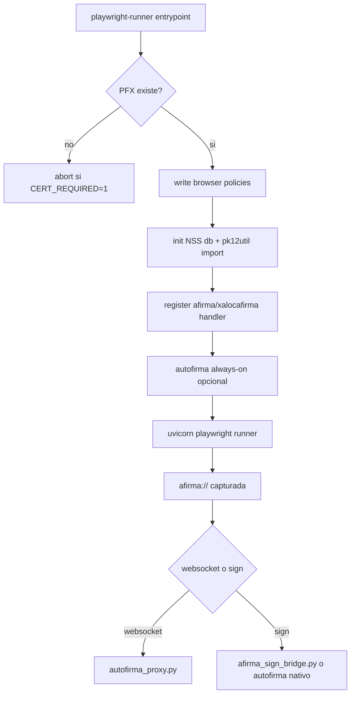

# 07 - Certificados y AutoFirma

## Objetivo
Documentar la inyeccion de certificado cliente y el manejo del protocolo `afirma://` dentro del runner Playwright en Docker.

## Flujo certificado + protocolo


## Piezas tecnicas
- `infra/docker/playwright-runner-entrypoint.sh`:
  - Escribe `AutoSelectCertificateForUrls`.
  - Escribe `AutoLaunchProtocolsFromOrigins`.
  - Inicializa DB NSS (`certutil -N`) e importa PFX (`pk12util`).
  - Registra handler XDG de esquemas `afirma` y `xalocafirma`.
- `infra/docker/afirma-handler.sh`:
  - Captura URI.
  - En modo websocket levanta `autofirma_proxy.py`.
  - En modo sign puede ejecutar bridge programatico o fallback a AutoFirma CLI.

## Variables clave
- Certificado:
  - `PLAYWRIGHT_CERT_PATH`
  - `PLAYWRIGHT_CERT_PASSWORD`
  - `PLAYWRIGHT_CERT_REQUIRED`
  - `PLAYWRIGHT_CLIENT_CERT_ORIGINS`
- Policy autoselect:
  - `XALOC_CERT_AUTOSELECT_VIA_POLICY`
  - `XALOC_CERT_AUTOSELECT_RULES_JSON`
  - `XALOC_CERT_AUTOSELECT_PATTERN`
  - `XALOC_CERT_FILTER_BY_CN`
  - `XALOC_CERT_CN` (preferida)
  - `XALOC_CERT_SUBJECT_CN` (alias)
  - `CERTIFICADO_CN` (legacy)
- Alias certificado (firma programatica):
  - `SIGNING_PFX_ALIAS`
  - `PLAYWRIGHT_CERT_ALIAS`
- AutoFirma:
  - `XALOC_AUTOFIRMA_ORIGIN`
  - `XALOC_AUTOFIRMA_ALLOWED_ORIGINS`
  - `XALOC_AUTOFIRMA_PROTOCOLS`
  - `XALOC_AFIRMA_PROXY_SCRIPT`

## Validacion rapida
```powershell
# Ejemplo en .env:
# XALOC_CERT_CN=ADRIA MARTINEZ (R: B12345678)
# SIGNING_PFX_ALIAS=adria_martinez__r__b12345678_

# 1) Confirmar variables aplicadas
docker compose --env-file .env -f infra/docker/docker-compose.microservices.yml config

# 2) Ver import NSS y policies en logs
docker compose --env-file .env -f infra/docker/docker-compose.microservices.yml logs -f --tail=300 playwright-runner-service

# 3) Ver salud runner
curl http://localhost:8111/health
```

## Runbooks de referencia existentes
- `PLAYWRIGHT_CERTIFICADO_DESDE_CERO.md`
- `PLAYWRIGHT_CERT_STORE_WINDOWS.md`
- `firma_hito_ayunta_palma_runbook.md`

## Puntos criticos
- Sin password correcta de PFX el runner puede quedar en restart loop.
- Si el origin no coincide exacto con handshake TLS, puede aparecer popup de seleccion.
- Problemas de firma suelen ser de integracion UI/protocolo (callback/estado) mas que de criptografia pura.
- No marcar exito de firma solo por callback; validar reflejo en estado de pagina.

## Checklist operativo
- [ ] Certificado importado en NSS (`certutil -L` en logs).
- [ ] Policy de autoseleccion escrita.
- [ ] Handler `afirma://` registrado.
- [ ] En flujo real, firma completa sin bloqueo por popup no controlado.
