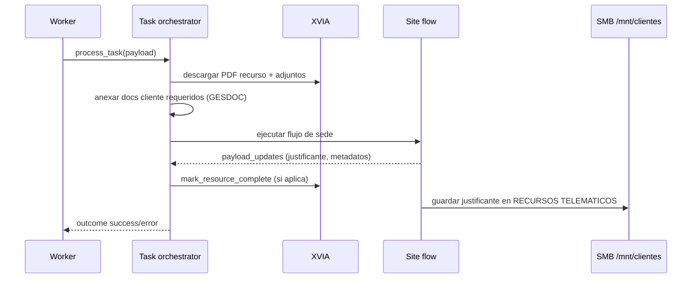

# 08 - Ciclo de Tramite y Documentos

## Objetivo
Detallar el ciclo completo de una ejecucion de tramite y como se descargan/guardan documentos y justificantes al finalizar.

## Flujo funcional


## Etapas de documentos
1. Descarga base desde XVIA:
- `core/worker_execution/document_fetcher.py` descarga PDF principal por `idRecurso`.
- Si hay metadata `adjuntos`, intenta descarga batch y fusion de lista `archivos`.

2. Documentacion cliente obligatoria:
- `core/client_documentation.py` infiere identidad y selecciona AUT/DNI/CIF/ESCR segun reglas.
- Puede activar flujo GESDOC y validaciones strict.

3. Ejecucion de site:
- Los flows pueden generar justificantes propios y rutas finales.
- `payload_updates` reporta indicadores por site (`*_justificante_descargado`, `*_justificante_path`, etc).

4. Guardado final de justificantes:
- `core/justificantes_storage.py` calcula destino cliente:
  - `<cliente>/RECURSOS TELEMATICOS[/subcarpeta por fase]`.
- Guarda con no-overwrite (`timestamp` si existe nombre).

## Estructura de carpetas de cliente
- Base path resuelto por `CLIENT_DOCS_BASE_PATH` (fallback por OS).
- Carpeta alfabetica (`A-C`, `D-E`, etc) + nombre normalizado de cliente.
- Subcarpeta fija `RECURSOS TELEMATICOS`.
- Subcarpeta opcional por fase (`IDENTIFICACIONES`, `ALEGACIONES`, `APREMIOS`, etc).

## Reglas de cierre por evidencia
- Xaloc Girona y Diputacio BCN: si no hay justificante, se fuerza fallo y no cierre automatico.
- Base Online: warning operativo si finaliza sin justificante.
- Otros sites: dependen de flags/reportes del flujo.

## Comandos utiles
```powershell
# Buscar referencias de guardado de justificante
rg -n "justificante|save_receipt_from_tmp|resolve_receipt_dir" core sites

# Buscar flags de cierre por site
rg -n "_justificante_descargado|skip_auto_complete|mark_resource_complete" core/worker_execution/task_orchestrator.py
```

## Puntos criticos
- Un tramite "enviado" sin justificante puede ser falso positivo operativo.
- La resolucion de ruta de cliente debe evitar path fantasma entre Windows y Linux.
- Archivos temporales deben limpiarse tras proceso para no contaminar siguientes jobs.

## Checklist operativo
- [ ] PDF base de XVIA descargado correctamente.
- [ ] Adjuntos relevantes incluidos en `payload[archivos]`.
- [ ] Justificante final persistido en ruta cliente esperada.
- [ ] Flags de `payload_updates` coherentes con evidencia real.
