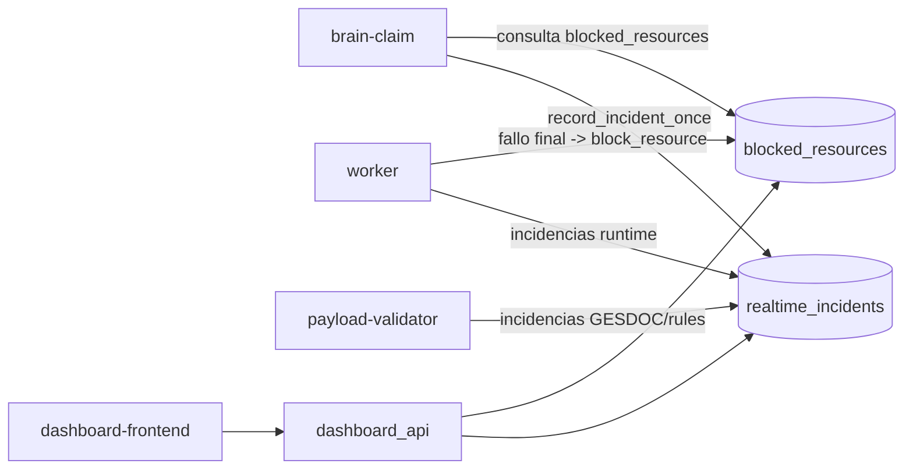

# 10 - Blacklist e Incidencias

## Objetivo
Explicar el funcionamiento de blacklist y incidencias: donde se almacenan, como se consultan en dashboard y como impactan en brain/worker.

## Flujo operativo


## Blacklist
- Almacenamiento: tabla `blocked_resources` (Postgres).
- API:
  - `GET /api/blacklist`
  - `POST /api/blacklist`
  - `DELETE /api/blacklist/{site_id}/{resource_id}`
- UI: pagina `/blacklist` para bloquear/desbloquear.

### Uso en runtime
- Brain descarta candidatos ya bloqueados antes de claim/publicacion.
- Worker bloquea automaticamente en fallos finales/no-retry para cortar loops.

## Incidencias
- Almacenamiento principal: `realtime_incidents`.
- Estados: `NEW`, `REVIEWED`, `RESOLVED`.
- API:
  - `GET /api/incidents`
  - `POST /api/incidents/{id}/claim`
  - `POST /api/incidents/{id}/release`
  - `DELETE /api/incidents/{site_id}/{resource_id}`
  - `GET /api/history/incidents`
- UI: pagina `/incidents` + historial en `/history`.

### Fuentes comunes
- `REGEX_DISCARDED`, `SITE_RULE_DISCARDED` desde adapters.
- `REQUIRES_GESDOC` y variantes desde validator.
- Fallos de ejecucion/firma/justificante desde worker.

## Criterios recomendados de uso
- Blacklist:
  - usar para bloqueos duros y repetitivos (dato corrupto, recurso invalido persistente).
- Incidencia:
  - usar para observabilidad y gestion de casos recuperables/manuales.

## Comandos utiles
```powershell
# Rutas API y servicios relacionados
rg -n "/api/blacklist|/api/incidents|history/incidents|block_blacklist|list_pending_incidents" dashboard_api.py dashboard/services.py

# Ver incidencias recientes en logs
docker compose --env-file .env -f infra/docker/docker-compose.microservices.yml logs -f --tail=200 brain-claim-service payload-validator-service worker-orchestrator-service
```

## Puntos criticos
- Resolver incidencia no implica desbloquear recurso automaticamente.
- Desbloquear sin corregir causa raiz puede reintroducir fallos en bucle.
- Las incidencias deben incluir contexto minimo (`site_id`, `resource_id`, `reason`, payload parcial).

## Checklist operativo
- [ ] Blacklist refleja exactamente recursos a excluir.
- [ ] Incidencias se crean con tipo y motivo accionable.
- [ ] Claim/release de incidencias se usa para evitar trabajo duplicado entre operadores.
- [ ] Historial conserva trazabilidad por dia y estado.
