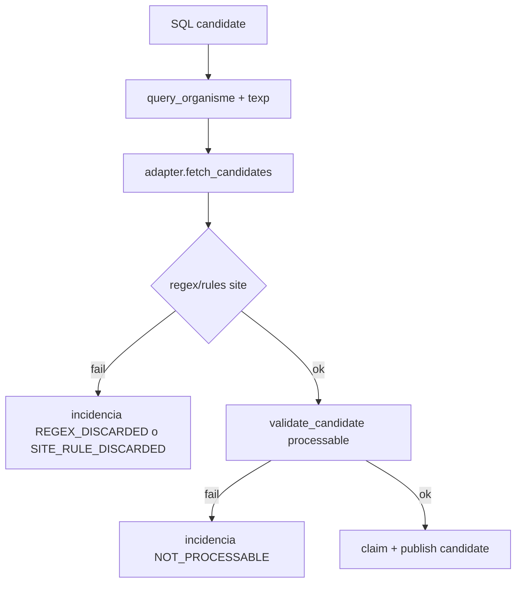

# 12 - Como Anadir o Ajustar Expedientes Validos

## Objetivo
Definir el proceso para ajustar que recursos son "procesables" por site/organismo, evitando descartes incorrectos o entrada de expedientes no validos.

## Donde viven las reglas
1. Configuracion global por site (`organismo_config`):
- `site_id`
- `query_organisme`
- `filtro_texp`
- `regex_expediente`
- `claim_limit_per_tick`
- `active`

2. Reglas de negocio finales por site en adapters:
- `sites/adapters/*.py`
- Validaciones tipicas:
  - patron de expediente
  - organismo permitido
  - fase permitida/bloqueada
  - campos minimos obligatorios

3. Validacion transversal de procesabilidad:
- `services/brain_claim/processable_validator.py`

## Flujo de decision


## Procedimiento recomendado (sin saltos)
1. Recolectar muestras reales:
- min 10 expedientes validos.
- min 10 no validos para evitar sobreajuste.

2. Ajustar `organismo_config`:
- Corregir `query_organisme` y `filtro_texp` si el filtro inicial ya viene mal.
- Ajustar `regex_expediente` solo como primera barrera.

3. Ajustar adapter del site:
- Incluir patrones oficiales y reglas adicionales en `fetch_candidates`.
- Cuando aplique, descartar con `on_discard` y motivo claro.

4. Validar descartes:
- Revisar incidencias generadas (`REGEX_DISCARDED`, `SITE_RULE_DISCARDED`).
- Confirmar que no se pierden casos validos.

5. Desplegar y monitorizar:
- Activar cambios, observar 1-2 ciclos completos de brain/worker.

## Ejemplos de reglas ya existentes
- `valencia.py`: lista oficial de regex + organismo target + reglas por fase.
- `redsara.py`: reglas por organismo con `destination_code` y regex por organismo.
- `madrid.py`, `base.py`, `ayunta_palma.py`: regex + reglas de fase/campos minimos.
- `diputacio_bcn.py`: catalogo ORGT y fases temporalmente bloqueadas.

## Comandos utiles
```powershell
# Ver reglas de descarte en adapters
rg -n "REGEX_DISCARDED|SITE_RULE_DISCARDED|on_discard|regex_expediente" sites/adapters

# Ver configuracion actual
Get-Content organismo_config.json

# Ver validacion transversal
Get-Content services/brain_claim/processable_validator.py
```

## Puntos criticos
- No confiar solo en regex; siempre combinar con regla de organismo y campos obligatorios.
- Evitar regex demasiado amplias (`^.+$`) sin filtros adicionales en adapter.
- Todo descarte debe tener `motivo` operativo para soporte.

## Checklist operativo
- [ ] Casuistica real de validos/no validos probada.
- [ ] `organismo_config` y adapter alineados.
- [ ] Incidencias de descarte explicables.
- [ ] No aumentan fallos downstream por payload incompleto.
