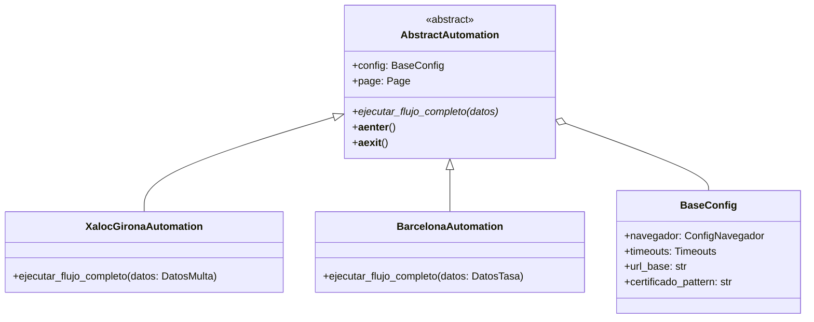

# Análisis de Extensibilidad a Múltiples Webs

## Resumen Ejecutivo

| Aspecto                        | Complejidad | Dificultad |
|--------------------------------|-------------|------------|
| Arquitectura multi-controlador | Baja        | ✅ 2/5     |
| Configuración por sitio        | Baja        | ✅ 2/5     |
| Certificado/Popup Windows      | **Nula**    | ✅ 1/5 (reutilizable) |
| Flujos (formularios/HTML)      | Media-Alta  | ⚠️ 3.5/5   |
| Orquestador abstracto          | Baja        | ✅ 2/5     |
| **Total estimado**             | **Media**   | **2.5/5**  |

> [!TIP]
> **Buenas noticias:** El certificado digital y el popup de Windows son **idénticos** para todos los sitios. La única variabilidad está en el HTML de cada formulario (campos, IDs, estructura).

---

## 1. Análisis del Código Actual

### Componentes Analizados

| Archivo                           | Función                          | Acoplamiento |
|-----------------------------------|----------------------------------|--------------|
| [config.py](file:///c:/Users/Guillem%20Vera/Desktop/Proyectos/xaloc2026-main/config.py) | Configuración global | **Alto** - URL y datos hardcoded |
| [main.py](file:///c:/Users/Guillem%20Vera/Desktop/Proyectos/xaloc2026-main/main.py) | Entry point | Bajo - genérico |
| [xaloc_automation.py](file:///c:/Users/Guillem%20Vera/Desktop/Proyectos/xaloc2026-main/xaloc_automation.py) | Orquestador | **Medio** - fases genéricas, imports específicos |
| [flows/login.py](file:///c:/Users/Guillem%20Vera/Desktop/Proyectos/xaloc2026-main/flows/login.py) | Autenticación VÀLid | **Alto** - selectores específicos |
| [flows/formulario.py](file:///c:/Users/Guillem%20Vera/Desktop/Proyectos/xaloc2026-main/flows/formulario.py) | Campos del formulario | **Muy Alto** - IDs específicos |
| [flows/documentos.py](file:///c:/Users/Guillem%20Vera/Desktop/Proyectos/xaloc2026-main/flows/documentos.py) | Subida archivos | Medio - popup genérico |
| [flows/confirmacion.py](file:///c:/Users/Guillem%20Vera/Desktop/Proyectos/xaloc2026-main/flows/confirmacion.py) | Paso final LOPD | **Alto** - selectores específicos |

### Puntos Fuertes (Reutilizables)

```diff
+ Arquitectura async/await con Playwright
+ Context managers (async with) bien implementados
+ Sistema de logging centralizado
+ Gestión de timeouts configurable
+ Popup de certificado Windows abstracto (pyautogui)
+ Estructura de flows modular
```

### Puntos Débiles (Hardcoded)

```diff
- URL base fija en Config
- Selectores CSS/IDs específicos (ej: #DinVarNUMDEN, #lopdok)
- Clase DatosMulta específica para un trámite
- Flujo de login asume VÀLid + estructura exacta
- Textos esperados en catalán (ej: "Tramitació en línia")
```

---

## 2. Propuesta de Arquitectura Multi-Web

### Nueva Estructura de Directorios

```
xaloc2026-multi/
├── core/                    # Núcleo reutilizable
│   ├── base_automation.py   # Clase abstracta AbstractAutomation
│   ├── base_config.py       # Configuración base
│   └── base_flows.py        # Interfaces de flujos
│
├── sites/                   # Un paquete por sitio
│   ├── xaloc_girona/
│   │   ├── config.py        # URLs, timeouts, certificados
│   │   ├── data_models.py   # DatosMulta (específico)
│   │   ├── flows/
│   │   │   ├── login.py
│   │   │   ├── formulario.py
│   │   │   └── ...
│   │   └── automation.py    # XalocGironaAutomation(AbstractAutomation)
│   │
│   ├── ajuntament_barcelona/
│   │   ├── config.py
│   │   ├── data_models.py   # DatosTasas, DatosLicencia...
│   │   └── ...
│   │
│   └── diputacio_lleida/
│       └── ...
│
├── utils/                   # Utilidades compartidas
│   ├── windows_popup.py     # ✅ Ya es genérico
│   ├── browser_helpers.py
│   └── field_fillers.py     # Funciones genéricas de rellenado
│
├── main.py                  # CLI selector de sitio
└── requirements.txt
```

### Diagrama de Clases



---

## 3. Desglose de Complejidad por Componente

### 3.1 Configuración por Sitio (Complejidad: ✅ Baja)

**Estado actual:**
```python
# config.py - Todo junto
url_base: str = "https://www.xalocgirona.cat/seu-electronica..."
```

**Propuesta:**
```python
# sites/xaloc_girona/config.py
@dataclass
class XalocGironaConfig(BaseConfig):
    url_base: str = "https://www.xalocgirona.cat/seu-electronica?view=tramits&id=11"
    login_pattern: str = "**/seu.xalocgirona.cat/sta/**"
    certificado_auto_pattern: str = '{"pattern":"*","filter":{}}'
    
# sites/barcelona/config.py
@dataclass
class BarcelonaConfig(BaseConfig):
    url_base: str = "https://seuelectronica.ajuntament.barcelona.cat/..."
    login_pattern: str = "**/autenticacio.barcelona.cat/**"
    certificado_auto_pattern: str = '{"pattern":"*.barcelona.cat","filter":{}}'
```

**Esfuerzo estimado:** 2-4 horas

---

### 3.2 Certificado y Popup Windows (Complejidad: ✅ Nula)

**¡Este componente es 100% reutilizable!**

El código actual en `utils/windows_popup.py` y la lógica de `--auto-select-certificate-for-urls` en el orquestador funcionan igual para cualquier web que use certificado digital. No requiere ningún cambio.

```python
# Ya implementado y reutilizable
from utils.windows_popup import esperar_y_aceptar_certificado
# Funciona para Xaloc, Diputació, Ajuntament, etc.
```

**Esfuerzo estimado:** 0 horas

---

### 3.3 Flujos de Formulario (Complejidad: 🔴 Alta)

**Este es el componente más complejo** porque cada web tiene:
- Campos diferentes (IDs, nombres, estructura)
- Validaciones client-side distintas
- Componentes ricos (TinyMCE, datepickers, selects dinámicos)

**Ejemplos de variabilidad:**

```python
# Xaloc Girona (actual)
campos = {
    "email": "#contact21",
    "num_denuncia": "#DinVarNUMDEN",
    "matricula": "#DinVarMATRICULA",
}

# Hipotético: Barcelona
campos = {
    "email": "input[name='correu_electronic']",
    "nif": "#camp_nif",
    "referencia_tribut": "#ref_tribut_001",
}
```

**Propuesta: Configuración declarativa**

```python
# sites/xaloc_girona/fields.py
FORM_FIELDS = [
    FieldConfig(name="email", selector="#contact21", type="input"),
    FieldConfig(name="num_denuncia", selector="#DinVarNUMDEN", type="input"),
    FieldConfig(name="motivos", selector="#DinVarMOTIUS", type="tinymce", iframe_id="DinVarMOTIUS_ifr"),
]

# Rellenador genérico
async def rellenar_formulario_generico(page: Page, fields: List[FieldConfig], datos: dict):
    for field in fields:
        valor = datos.get(field.name)
        if field.type == "input":
            await _rellenar_input(page, field.selector, valor)
        elif field.type == "tinymce":
            await _rellenar_tinymce(page, field.selector, field.iframe_id, valor)
        # ... más tipos
```

**Esfuerzo estimado:** 16-24 horas (framework) + 4-8 horas por sitio nuevo

---

### 3.4 Sistema de Login (Complejidad: ✅ Baja-Media)

**Escenario simplificado:**
Si todas las webs usan VÀLid/certificado con el mismo flujo, el código de `flows/login.py` es mayormente reutilizable. Lo único que cambia:

| Elemento | Variabilidad |
|----------|-------------|
| URL inicial | Configurable |
| Texto del enlace "Tramitació" | Puede variar (regex) |
| Selector botón certificado | Puede variar |
| URL de retorno post-login | Configurable |

**Propuesta simple:**
```python
# sites/xaloc/config.py
login_config = {
    "url_tramite": "https://www.xalocgirona.cat/seu-electronica?view=tramits&id=11",
    "enlace_pattern": r"Tramitaci[oó] en l[ií]nia",
    "boton_cert_selector": "#btnContinuaCert",
    "url_post_login": "**/seu.xalocgirona.cat/sta/**"
}

# sites/diputacio/config.py  
login_config = {
    "url_tramite": "https://www.ddgi.cat/seu-electronica/...",
    "enlace_pattern": r"Iniciar tr[aà]mit",
    "boton_cert_selector": "#certificatBtn",
    "url_post_login": "**/tramits.ddgi.cat/**"
}
```

**Esfuerzo estimado:** 4-6 horas (hacer login configurable)

---

## 4. Matriz de Esfuerzo (Actualizada)

| Tarea | Horas Estimadas | Dependencias |
|-------|-----------------|--------------|
| Configuración parametrizable | 4-6h | - |
| Login configurable | 4-6h | Config |
| Framework de campos por sitio | 8-12h | - |
| Migrar Xaloc al nuevo sistema | 2-4h | Todo lo anterior |

### Total para MVP multi-sitio: **20-30 horas**
### Cada sitio adicional: **8-16 horas** (explorar HTML + mapear campos)

---

## 5. Riesgos y Consideraciones

> [!WARNING]
> **Riesgo Alto: Variabilidad de las webs administrativas**
> Cada administración usa tecnologías diferentes (Angular, jQuery, React, iframes legacy). El framework debe ser muy flexible.

> [!CAUTION]
> **Riesgo Alto: Cambios frecuentes en las webs**
> Las administraciones actualizan sus portales sin previo aviso. Se necesita:
> - Sistema de alertas cuando los selectores fallan
> - Versionado de configuraciones por sitio
> - Tests de salud periódicos

### Otras consideraciones

| Aspecto | Impacto | Mitigación |
|---------|---------|------------|
| Diferentes idiomas | Medio | i18n para textos esperados (botones, enlaces) |
| Rate limiting | Bajo | Delays configurables entre acciones |
| CAPTCHAs | Alto | Algunas webs lo tienen; requiere intervención manual |
| Popups de cookies | Bajo | Ya manejado, pero patrones varían |
| Iframes anidados | Alto | Abstracción de frame_locator por sitio |

---

## 6. Recomendaciones

### Enfoque Pragmático
1. **Crear carpeta `sites/`** con subcarpetas por web
2. **Parametrizar `config.py`** para aceptar URLs y selectores por sitio
3. **Explorar el HTML** de cada nueva web para mapear campos
4. **Reutilizar** `windows_popup.py` y helpers sin cambios

### Workflow para añadir nuevo sitio
```
1. Crear sites/nueva_web/config.py  (URLs, selectores)
2. Crear sites/nueva_web/campos.py  (mapeo de campos)
3. Navegar manualmente por la web → inspeccionar HTML
4. Copiar/adaptar flows si el flujo difiere
5. Testing y ajustes
```

### Evitar
- Sobre-ingeniería si los sitios son similares
- Automatizar el envío real sin supervisión humana

---

## 7. Conclusión

**¿Es factible reutilizar la aplicación para diferentes webs?**

✅ **Sí, con esfuerzo moderado.**

Dado que el certificado y popup de Windows son iguales para todos los sitios:
- **20-30 horas** de inversión inicial para hacer el sistema configurable
- **8-16 horas** por cada nuevo sitio (principalmente explorar el HTML y mapear campos)
- La complejidad principal está en **entender la estructura HTML** de cada formulario

El código de autenticación, gestión de certificados y utilidades es **directamente reutilizable**. El trabajo por sitio consiste en:
1. Identificar selectores CSS/IDs de los campos
2. Mapear datos de entrada al formulario específico
3. Adaptar textos/patrones regex si el idioma difiere
