# 🧠 Plan de Implementación: Módulo Orquestador (The Brain)

Este documento detalla todas las modificaciones, estructura y pasos necesarios para implementar el módulo de orquestación descrito en [brain.md](file:///c:/Users/Guillem%20Vera/Desktop/Proyectos/xaloc2026-main/brain.md).

---

## 📋 Resumen Ejecutivo

El objetivo es crear un módulo "cerebro" que **detecte, reclame y distribuya tareas** automáticamente desde SQL Server hacia los workers de automatización. Esto permitirá escalar el sistema a múltiples webs sin reinventar la rueda.

---

## 1. Estructura de Archivos a Crear/Modificar

### 📁 Archivos Nuevos

| Archivo | Ubicación | Descripción |
|---------|-----------|-------------|
| `brain.py` | `/` (raíz) | Script principal del orquestador (bucle principal) |
| `organismo_config.json` | `/` (raíz) | Configuración dinámica por organismo/site |
| `db/schema_brain.sql` | `/db/` | Esquema adicional para la tabla `organismo_config` |

### 📁 Archivos a Modificar

| Archivo | Ubicación | Modificaciones |
|---------|-----------|----------------|
| [sqlite_db.py](file:///c:/Users/Guillem%20Vera/Desktop/Proyectos/xaloc2026-main/core/sqlite_db.py) | `/core/` | Añadir métodos para gestionar `organismo_config` |
| [db/schema.sql](file:///c:/Users/Guillem%20Vera/Desktop/Proyectos/xaloc2026-main/db/schema.sql) | `/db/` | Incluir nueva tabla `organismo_config` |

---

## 2. Modelo de Datos

### 2.1 Tabla: `organismo_config` (SQLite - Nueva)

Esta tabla almacena las reglas de negocio para cada sitio web/organismo.

```sql
CREATE TABLE IF NOT EXISTS organismo_config (
    id INTEGER PRIMARY KEY AUTOINCREMENT,
    site_id TEXT NOT NULL UNIQUE,           -- 'xaloc_girona', 'madrid', 'base_online'
    query_organisme TEXT NOT NULL,          -- Filtro LIKE para SQL Server: '%XALOC%'
    filtro_texp TEXT NOT NULL,              -- Tipos de expediente válidos CSV: '2,3'
    regex_expediente TEXT NOT NULL,         -- Patrón regex: '^.{3}/.{6}-MUL$'
    url_template TEXT,                      -- URL directa (opcional): 'http://.../telematicos?Expedient={expediente}'
    bot_username TEXT NOT NULL,             -- Nombre de usuario del bot: 'BOT_MULTIVIA'
    active INTEGER DEFAULT 1,               -- 1 = Activo, 0 = Inactivo
    last_sync_at TIMESTAMP,                 -- Última sincronización
    created_at TIMESTAMP DEFAULT CURRENT_TIMESTAMP,
    updated_at TIMESTAMP DEFAULT CURRENT_TIMESTAMP
);
```

### 2.2 Autenticación y Proceso de Asignación

> [!IMPORTANT]
> **Requisito de sesión:** Para poder reclamar recursos en la plataforma Xvia, es necesario **iniciar sesión** previamente usando las credenciales almacenadas en el archivo `.env`.

#### Variables de Entorno para Autenticación

```env
# Credenciales Xvia (en archivo .env)
XVIA_EMAIL=usuario@multivia.es
XVIA_PASSWORD=contraseña_segura
```

#### Flujo de Autenticación

```mermaid
sequenceDiagram
    participant Brain as 🧠 Brain
    participant Browser as 🌐 Playwright
    participant Xvia as 📡 Xvia Platform
    participant SQL as 🗄️ SQL Server
    
    Brain->>Browser: Iniciar navegador
    Browser->>Xvia: GET /login
    Browser->>Xvia: POST login (XVIA_EMAIL, XVIA_PASSWORD)
    Xvia-->>Browser: Session cookie + token
    
    loop Para cada recurso
        Browser->>Xvia: GET /recursos/telematicos?Expedient=...
        Browser->>Xvia: Click "Asignarme" (auto-selecciona usuario logueado)
        Xvia-->>SQL: UPDATE UsuarioAsignado = usuario_sesion
        Xvia-->>Browser: Confirmación
    end
```



#### Lógica del Claim vía Scraping

El proceso de reclamación **no se hace directamente en SQL Server** sino a través de **scraping con Playwright**:

1. **Login:** El brain inicia sesión en `http://www.xvia-grupoeuropa.net/intranet/` usando `XVIA_EMAIL` y `XVIA_PASSWORD`
2. **Navegación:** Accede a la URL del listado de recursos telemáticos
3. **Asignación:** Al hacer clic en "Asignarme", la plataforma **automáticamente asigna el usuario de la sesión activa** (el `UsuarioAsignado` se establece con el nombre del usuario logueado)
4. **Verificación:** Después del clic, se verifica que `TExp` cambió a `1` consultando SQL Server

#### Ejemplo de Configuración Inicial

```json
{
    "xaloc_girona": {
        "site_id": "xaloc_girona",
        "query_organisme": "%XALOC%",
        "filtro_texp": "2,3",
        "regex_expediente": "^\\d{4}/\\d{6}-MUL$",
        "login_url": "http://www.xvia-grupoeuropa.net/intranet/xvia-grupoeuropa/public/login",
        "recursos_url": "http://www.xvia-grupoeuropa.net/intranet/xvia-grupoeuropa/public/servicio/recursos/telematicos",
        "active": true,
        "notes": "Autenticación requerida - usa XVIA_EMAIL y XVIA_PASSWORD del .env"
    }
}
```

> [!NOTE]
> El campo `bot_username` ya no es necesario en la configuración porque el **usuario se determina automáticamente por la sesión activa** tras el login.

---

## 3. Arquitectura del Orquestador (brain.py)

### 3.1 Diagrama de Flujo

```mermaid
flowchart TD
    A[Iniciar Brain] --> B[Cargar configuraciones activas]
    B --> C{Hay configs activas?}
    C -->|No| Z[Esperar 300s]
    C -->|Sí| D[Para cada config...]
    D --> E[Consultar SQL Server]
    E --> F{Hay recursos disponibles?}
    F -->|No| G[Siguiente config]
    F -->|Sí| H[Para cada recurso...]
    H --> I[Intentar CLAIM atómico]
    I --> J{Claim exitoso?}
    J -->|No| K[Log warning + siguiente]
    J -->|Sí| L[Generar URL directa]
    L --> M[Encolar en SQLite]
    M --> N[Log success]
    N --> K
    K --> O{Más recursos?}
    O -->|Sí| H
    O -->|No| G
    G --> P{Más configs?}
    P -->|Sí| D
    P -->|No| Z
    Z --> B
```



### 3.2 Estructura del Script `brain.py`

```python
"""
brain.py - Orquestador principal del sistema.

Responsabilidades:
1. Leer configuraciones activas desde SQLite
2. Consultar recursos disponibles en SQL Server
3. Reclamar recursos de forma atómica
4. Encolar tareas para los workers
"""

import asyncio
import logging
import re
import pyodbc
from pathlib import Path
from datetime import datetime
from core.sqlite_db import SQLiteDatabase

# =============================================================================
# CONSTANTES Y CONFIGURACIÓN
# =============================================================================

SYNC_INTERVAL_SECONDS = 300  # 5 minutos entre ciclos
MAX_CLAIMS_PER_CYCLE = 50    # Límite de recursos por ciclo

# =============================================================================
# CLASE PRINCIPAL: BrainOrchestrator
# =============================================================================

class BrainOrchestrator:
    """
    Orquestador que gestiona la detección, reclamación y distribución de recursos.
    """
    
    def __init__(self, sqlite_path: str, sqlserver_conn_str: str):
        self.db = SQLiteDatabase(sqlite_path)
        self.sqlserver_conn_str = sqlserver_conn_str
        self.logger = logging.getLogger("brain")
    
    # -------------------------------------------------------------------------
    # PASO 1: Obtener configuraciones activas
    # -------------------------------------------------------------------------
    def get_active_configs(self) -> list[dict]:
        """Retorna todas las configuraciones de organismos activos."""
        pass
    
    # -------------------------------------------------------------------------
    # PASO 2: Consultar recursos candidatos en SQL Server
    # -------------------------------------------------------------------------
    def fetch_remote_resources(self, config: dict) -> list[dict]:
        """
        Consulta recursos en SQL Server con los siguientes filtros:
        - Organisme LIKE config.query_organisme
        - TExp IN (filtro_texp)
        - Estado = 0
        - Expedient valida regex
        """
        pass
    
    # -------------------------------------------------------------------------
    # PASO 3: Reclamar recurso (CLAIM atómico)
    # -------------------------------------------------------------------------
    def claim_resource_on_remote(self, id_recurso: int, bot_username: str) -> bool:
        """
        Ejecuta UPDATE atómico:
        UPDATE Recursos.RecursosExp 
        SET TExp = 1, UsuarioAsignado = ?
        WHERE idRecurso = ? AND Estado = 0 AND TExp IN (2,3)
        
        Retorna True si rowcount > 0 (reclamo exitoso).
        """
        pass
    
    # -------------------------------------------------------------------------
    # PASO 4: Generar URL directa
    # -------------------------------------------------------------------------
    def build_direct_url(self, template: str, expediente: str) -> str:
        """Inyecta el expediente en el url_template."""
        return template.replace("{expediente}", expediente)
    
    # -------------------------------------------------------------------------
    # PASO 5: Encolar tarea localmente
    # -------------------------------------------------------------------------
    def enqueue_locally(self, site_id: str, payload: dict) -> int:
        """Inserta la tarea en tramite_queue de SQLite."""
        return self.db.insert_task(site_id, None, payload)
    
    # -------------------------------------------------------------------------
    # BUCLE PRINCIPAL
    # -------------------------------------------------------------------------
    async def run(self):
        """Bucle principal del orquestador."""
        while True:
            try:
                configs = self.get_active_configs()
                
                for config in configs:
                    recursos = self.fetch_remote_resources(config)
                    
                    for recurso in recursos[:MAX_CLAIMS_PER_CYCLE]:
                        if self.claim_resource_on_remote(
                            recurso["idRecurso"], 
                            config["bot_username"]
                        ):
                            url = self.build_direct_url(
                                config.get("url_template", ""),
                                recurso["Expedient"]
                            )
                            payload = self._build_payload(recurso, url)
                            self.enqueue_locally(config["site_id"], payload)
                            
            except Exception as e:
                self.logger.error(f"Error en ciclo brain: {e}")
            
            await asyncio.sleep(SYNC_INTERVAL_SECONDS)
    
    def _build_payload(self, recurso: dict, direct_url: str) -> dict:
        """Construye el payload para el worker."""
        pass


# =============================================================================
# PUNTO DE ENTRADA
# =============================================================================

if __name__ == "__main__":
    # Configuración de logging
    # Carga de variables de entorno
    # Instanciación y ejecución del orquestador
    pass
```

---

## 4. Pasos de Implementación Detallados

### ✅ FASE 1: Preparación de Base de Datos

#### Paso 1.1: Crear tabla `organismo_config`

**Archivo:** `db/schema.sql` (modificar)

```diff
+ -- Tabla de configuración de organismos para el orquestador
+ CREATE TABLE IF NOT EXISTS organismo_config (
+     id INTEGER PRIMARY KEY AUTOINCREMENT,
+     site_id TEXT NOT NULL UNIQUE,
+     query_organisme TEXT NOT NULL,
+     filtro_texp TEXT NOT NULL,
+     regex_expediente TEXT NOT NULL,
+     url_template TEXT,
+     bot_username TEXT NOT NULL DEFAULT 'BOT_MULTIVIA',
+     active INTEGER DEFAULT 1,
+     last_sync_at TIMESTAMP,
+     created_at TIMESTAMP DEFAULT CURRENT_TIMESTAMP,
+     updated_at TIMESTAMP DEFAULT CURRENT_TIMESTAMP
+ );
```

#### Paso 1.2: Insertar configuración inicial de xaloc_girona

```sql
INSERT INTO organismo_config (
    site_id, 
    query_organisme, 
    filtro_texp, 
    regex_expediente, 
    url_template, 
    bot_username
) VALUES (
    'xaloc_girona',
    '%XALOC%',
    '2,3',
    '^\d{4}/\d{6}-MUL$',
    'http://www.xvia-grupoeuropa.net/intranet/xvia-grupoeuropa/public/servicio/recursos/telematicos?Expedient={expediente}',
    'BOT_MULTIVIA'
);
```

---

### ✅ FASE 2: Extensiones en SQLite

#### Paso 2.1: Añadir métodos a `core/sqlite_db.py`

**Métodos nuevos a implementar:**

```python
class SQLiteDatabase:
    # ... métodos existentes ...
    
    # ==========================================================================
    # MÉTODOS PARA ORGANISMO_CONFIG
    # ==========================================================================
    
    def get_active_organismo_configs(self) -> list[dict]:
        """
        Retorna todas las configuraciones de organismos activos.
        
        Returns:
            Lista de dicts con: site_id, query_organisme, filtro_texp, 
            regex_expediente, url_template, bot_username
        """
        conn = self.get_connection()
        conn.row_factory = sqlite3.Row
        try:
            cursor = conn.cursor()
            cursor.execute("""
                SELECT site_id, query_organisme, filtro_texp, 
                       regex_expediente, url_template, bot_username
                FROM organismo_config
                WHERE active = 1
            """)
            return [dict(row) for row in cursor.fetchall()]
        finally:
            conn.close()
    
    def update_last_sync(self, site_id: str) -> None:
        """Actualiza el timestamp de última sincronización."""
        conn = self.get_connection()
        try:
            cursor = conn.cursor()
            cursor.execute("""
                UPDATE organismo_config
                SET last_sync_at = ?, updated_at = ?
                WHERE site_id = ?
            """, (datetime.now().isoformat(), datetime.now().isoformat(), site_id))
            conn.commit()
        finally:
            conn.close()
    
    def insert_organismo_config(self, config: dict) -> int:
        """Inserta una nueva configuración de organismo."""
        conn = self.get_connection()
        try:
            cursor = conn.cursor()
            cursor.execute("""
                INSERT INTO organismo_config (
                    site_id, query_organisme, filtro_texp, 
                    regex_expediente, url_template, bot_username, active
                ) VALUES (?, ?, ?, ?, ?, ?, ?)
            """, (
                config['site_id'],
                config['query_organisme'],
                config['filtro_texp'],
                config['regex_expediente'],
                config.get('url_template'),
                config.get('bot_username', 'BOT_MULTIVIA'),
                config.get('active', 1)
            ))
            conn.commit()
            return cursor.lastrowid
        finally:
            conn.close()
```

---

### ✅ FASE 3: Crear Módulo Brain

#### Paso 3.1: Crear `brain.py` en raíz

> [!IMPORTANT]
> Este es el script principal que debe ejecutarse como un **servicio persistente**.

**Estructura completa del archivo:**

```python
#!/usr/bin/env python
"""
brain.py - Orquestador principal del sistema Xvia.

Este módulo es responsable de:
1. Detectar recursos disponibles en SQL Server
2. Reclamar recursos de forma atómica (evitar colisiones)
3. Distribuir tareas a la cola local de workers

Uso:
    python brain.py [--once] [--dry-run]

Opciones:
    --once      Ejecutar un solo ciclo (para testing)
    --dry-run   No realizar cambios en las bases de datos
"""

import argparse
import asyncio
import logging
import os
import re
import sys
from datetime import datetime
from pathlib import Path
from typing import Optional

import pyodbc
from dotenv import load_dotenv

from core.sqlite_db import SQLiteDatabase


# =============================================================================
# CONFIGURACIÓN
# =============================================================================

load_dotenv()

SYNC_INTERVAL_SECONDS = int(os.getenv("BRAIN_SYNC_INTERVAL", 300))
MAX_CLAIMS_PER_CYCLE = int(os.getenv("BRAIN_MAX_CLAIMS", 50))
SQLITE_DB_PATH = os.getenv("SQLITE_DB_PATH", "db/xaloc_database.db")

logging.basicConfig(
    level=logging.INFO,
    format="%(asctime)s - [BRAIN] - %(levelname)s - %(message)s",
    handlers=[
        logging.StreamHandler(sys.stdout),
        logging.FileHandler("logs/brain.log", encoding="utf-8")
    ]
)
logger = logging.getLogger("brain")


# =============================================================================
# CONSULTAS SQL SERVER
# =============================================================================

SQL_FETCH_RECURSOS = """
SELECT 
    rs.idRecurso,
    rs.idExp,
    rs.Expedient,
    rs.Organisme,
    rs.TExp,
    rs.Estado,
    rs.numclient,
    rs.SujetoRecurso,
    rs.FaseProcedimiento
FROM Recursos.RecursosExp rs
WHERE rs.Organisme LIKE ?
  AND rs.TExp IN ({texp_list})
  AND rs.Estado = 0
  AND rs.Expedient IS NOT NULL
ORDER BY rs.idRecurso ASC
"""

SQL_CLAIM_RESOURCE = """
UPDATE Recursos.RecursosExp 
SET TExp = 1, UsuarioAsignado = ?
WHERE idRecurso = ? 
  AND Estado = 0 
  AND TExp IN (2, 3)
"""


# =============================================================================
# CLASE PRINCIPAL
# =============================================================================

class BrainOrchestrator:
    """
    Orquestador central que gestiona la detección, reclamación y 
    distribución de recursos desde SQL Server hacia los workers locales.
    """
    
    def __init__(
        self, 
        sqlite_db: SQLiteDatabase, 
        sqlserver_conn_str: str,
        dry_run: bool = False
    ):
        self.db = sqlite_db
        self.sqlserver_conn_str = sqlserver_conn_str
        self.dry_run = dry_run
        self.logger = logger
        
    # -------------------------------------------------------------------------
    # PASO 1: Obtener configuraciones activas
    # -------------------------------------------------------------------------
    def get_active_configs(self) -> list[dict]:
        """Obtiene todas las configuraciones de organismos activos."""
        return self.db.get_active_organismo_configs()
    
    # -------------------------------------------------------------------------
    # PASO 2: Consultar recursos candidatos
    # -------------------------------------------------------------------------
    def fetch_remote_resources(self, config: dict) -> list[dict]:
        """
        Consulta recursos en SQL Server que cumplan:
        - Organisme LIKE config.query_organisme
        - TExp IN (filtro_texp)
        - Estado = 0
        - Expedient válido según regex
        """
        texp_values = [int(x.strip()) for x in config["filtro_texp"].split(",")]
        texp_placeholders = ",".join(["?"] * len(texp_values))
        
        query = SQL_FETCH_RECURSOS.format(texp_list=texp_placeholders)
        
        try:
            conn = pyodbc.connect(self.sqlserver_conn_str)
            cursor = conn.cursor()
            cursor.execute(query, [config["query_organisme"]] + texp_values)
            
            columns = [column[0] for column in cursor.description]
            results = []
            
            regex = re.compile(config["regex_expediente"])
            
            for row in cursor.fetchall():
                record = dict(zip(columns, row))
                expediente = record.get("Expedient", "")
                
                # Validar formato de expediente
                if expediente and regex.match(expediente):
                    results.append(record)
                else:
                    self.logger.debug(
                        f"Expediente descartado por regex: {expediente}"
                    )
            
            conn.close()
            self.logger.info(
                f"[{config['site_id']}] Encontrados {len(results)} recursos válidos"
            )
            return results
            
        except Exception as e:
            self.logger.error(f"Error consultando SQL Server: {e}")
            return []
    
    # -------------------------------------------------------------------------
    # PASO 3: Reclamar recurso (CLAIM atómico)
    # -------------------------------------------------------------------------
    def claim_resource_on_remote(
        self, 
        id_recurso: int, 
        bot_username: str
    ) -> bool:
        """
        Ejecuta UPDATE atómico en SQL Server.
        Retorna True si el reclamo fue exitoso (rowcount > 0).
        """
        if self.dry_run:
            self.logger.info(f"[DRY-RUN] Claim simulado para idRecurso={id_recurso}")
            return True
        
        try:
            conn = pyodbc.connect(self.sqlserver_conn_str)
            cursor = conn.cursor()
            cursor.execute(SQL_CLAIM_RESOURCE, (bot_username, id_recurso))
            
            success = cursor.rowcount > 0
            
            if success:
                conn.commit()
                self.logger.info(
                    f"✓ Recurso {id_recurso} reclamado para {bot_username}"
                )
            else:
                self.logger.warning(
                    f"✗ Recurso {id_recurso} ya no disponible (race condition)"
                )
            
            conn.close()
            return success
            
        except Exception as e:
            self.logger.error(f"Error en claim de recurso {id_recurso}: {e}")
            return False
    
    # -------------------------------------------------------------------------
    # PASO 4: Generar URL directa
    # -------------------------------------------------------------------------
    def build_direct_url(self, template: Optional[str], expediente: str) -> str:
        """Inyecta el expediente en el url_template."""
        if not template:
            return ""
        return template.replace("{expediente}", expediente)
    
    # -------------------------------------------------------------------------
    # PASO 5: Construir payload
    # -------------------------------------------------------------------------
    def build_payload(self, recurso: dict, direct_url: str, config: dict) -> dict:
        """
        Construye el payload compatible con el worker.
        
        Este método debe mapear los campos de SQL Server a los campos
        que espera el worker (similar a sync_by_id_to_worker.py).
        """
        return {
            "idRecurso": recurso["idRecurso"],
            "idExp": recurso.get("idExp"),
            "expediente": recurso["Expedient"],
            "numclient": recurso.get("numclient"),
            "sujeto_recurso": recurso.get("SujetoRecurso"),
            "fase_procedimiento": recurso.get("FaseProcedimiento"),
            "direct_url": direct_url,
            "source": "brain_orchestrator",
            "claimed_at": datetime.now().isoformat()
        }
    
    # -------------------------------------------------------------------------
    # PASO 6: Encolar tarea
    # -------------------------------------------------------------------------
    def enqueue_locally(self, site_id: str, payload: dict) -> int:
        """Inserta la tarea en tramite_queue de SQLite."""
        if self.dry_run:
            self.logger.info(f"[DRY-RUN] Encolado simulado: {payload['expediente']}")
            return -1
        
        task_id = self.db.insert_task(site_id, None, payload)
        self.logger.info(
            f"📥 Tarea {task_id} encolada: {payload['expediente']} -> {site_id}"
        )
        return task_id
    
    # -------------------------------------------------------------------------
    # CICLO PRINCIPAL
    # -------------------------------------------------------------------------
    async def run_cycle(self) -> dict:
        """
        Ejecuta un ciclo completo de sincronización.
        
        Returns:
            Dict con estadísticas: claimed, enqueued, errors
        """
        stats = {"claimed": 0, "enqueued": 0, "errors": 0}
        
        configs = self.get_active_configs()
        if not configs:
            self.logger.warning("No hay configuraciones activas")
            return stats
        
        self.logger.info(f"Procesando {len(configs)} configuraciones activas")
        
        for config in configs:
            site_id = config["site_id"]
            self.logger.info(f"── Iniciando sync para: {site_id}")
            
            try:
                recursos = self.fetch_remote_resources(config)
                
                for recurso in recursos[:MAX_CLAIMS_PER_CYCLE]:
                    try:
                        if self.claim_resource_on_remote(
                            recurso["idRecurso"],
                            config["bot_username"]
                        ):
                            stats["claimed"] += 1
                            
                            direct_url = self.build_direct_url(
                                config.get("url_template"),
                                recurso["Expedient"]
                            )
                            
                            payload = self.build_payload(recurso, direct_url, config)
                            self.enqueue_locally(site_id, payload)
                            stats["enqueued"] += 1
                            
                    except Exception as e:
                        self.logger.error(f"Error procesando recurso: {e}")
                        stats["errors"] += 1
                
                # Actualizar timestamp de última sincronización
                if not self.dry_run:
                    self.db.update_last_sync(site_id)
                    
            except Exception as e:
                self.logger.error(f"Error en config {site_id}: {e}")
                stats["errors"] += 1
        
        return stats
    
    async def run_forever(self):
        """Bucle infinito del orquestador."""
        self.logger.info("=" * 60)
        self.logger.info("🧠 BRAIN ORCHESTRATOR INICIADO")
        self.logger.info(f"   Intervalo: {SYNC_INTERVAL_SECONDS}s")
        self.logger.info(f"   Max claims/ciclo: {MAX_CLAIMS_PER_CYCLE}")
        self.logger.info(f"   Dry-run: {self.dry_run}")
        self.logger.info("=" * 60)
        
        while True:
            try:
                stats = await self.run_cycle()
                self.logger.info(
                    f"📊 Ciclo completado: "
                    f"claimed={stats['claimed']}, "
                    f"enqueued={stats['enqueued']}, "
                    f"errors={stats['errors']}"
                )
            except Exception as e:
                self.logger.error(f"Error fatal en ciclo: {e}")
            
            self.logger.info(f"💤 Esperando {SYNC_INTERVAL_SECONDS}s...")
            await asyncio.sleep(SYNC_INTERVAL_SECONDS)


# =============================================================================
# UTILIDADES
# =============================================================================

def build_sqlserver_connection_string() -> str:
    """
    Construye el connection string para SQL Server.
    Prioridad: variable de entorno completa > variables separadas.
    """
    direct = os.getenv("SQLSERVER_CONNECTION_STRING")
    if direct:
        return direct
    
    driver = os.getenv("SQLSERVER_DRIVER", "{ODBC Driver 17 for SQL Server}")
    server = os.getenv("SQLSERVER_SERVER")
    database = os.getenv("SQLSERVER_DATABASE")
    username = os.getenv("SQLSERVER_USERNAME")
    password = os.getenv("SQLSERVER_PASSWORD")
    
    if os.getenv("SQLSERVER_TRUSTED_CONNECTION") == "1":
        return f"DRIVER={driver};SERVER={server};DATABASE={database};Trusted_Connection=yes"
    
    return f"DRIVER={driver};SERVER={server};DATABASE={database};UID={username};PWD={password}"


# =============================================================================
# PUNTO DE ENTRADA
# =============================================================================

def main():
    parser = argparse.ArgumentParser(
        description="Brain Orchestrator - Gestor de recursos Xvia"
    )
    parser.add_argument(
        "--once", 
        action="store_true",
        help="Ejecutar un solo ciclo y salir"
    )
    parser.add_argument(
        "--dry-run",
        action="store_true",
        help="No realizar cambios en las bases de datos"
    )
    parser.add_argument(
        "--sqlite-db",
        default=SQLITE_DB_PATH,
        help="Ruta al archivo SQLite"
    )
    
    args = parser.parse_args()
    
    # Inicializar componentes
    db = SQLiteDatabase(args.sqlite_db)
    conn_str = build_sqlserver_connection_string()
    
    orchestrator = BrainOrchestrator(
        sqlite_db=db,
        sqlserver_conn_str=conn_str,
        dry_run=args.dry_run
    )
    
    # Ejecutar
    if args.once:
        stats = asyncio.run(orchestrator.run_cycle())
        print(f"Ciclo completado: {stats}")
    else:
        asyncio.run(orchestrator.run_forever())


if __name__ == "__main__":
    main()
```

---

### ✅ FASE 4: Archivo de Configuración JSON

#### Paso 4.1: Crear `organismo_config.json`

Este archivo sirve como **seed inicial** y documentación de las configuraciones disponibles.

```json
{
    "configs": [
        {
            "site_id": "xaloc_girona",
            "query_organisme": "%XALOC%",
            "filtro_texp": "2,3",
            "regex_expediente": "^\\d{4}/\\d{6}-MUL$",
            "url_template": "http://www.xvia-grupoeuropa.net/intranet/xvia-grupoeuropa/public/servicio/recursos/telematicos?_token={token}&Expedient={expediente}",
            "bot_username": "BOT_MULTIVIA",
            "active": true,
            "notes": "XALOC Girona - Multas de tráfico"
        },
        {
            "site_id": "madrid",
            "query_organisme": "%MADRID%",
            "filtro_texp": "2,3",
            "regex_expediente": "^.*$",
            "url_template": null,
            "bot_username": "BOT_MULTIVIA",
            "active": false,
            "notes": "Pendiente de definir formato de expediente"
        }
    ]
}
```

---

## 5. Integración con Componentes Existentes

### 5.1 Relación con `sync_by_id_to_worker.py`

El script actual [sync_by_id_to_worker.py](file:///c:/Users/Guillem%20Vera/Desktop/Proyectos/xaloc2026-main/sync_by_id_to_worker.py) procesa **un único recurso por ID**. El nuevo `brain.py` debe:

1. **Reutilizar funciones existentes:**
   - `get_motivos_por_fase()` para generar el payload correcto
   - `_map_payload()` para formatear los datos

2. **Extraer lógica compartida** a un módulo común:

```
core/
    payload_builder.py  # Nuevo: Lógica de construcción de payloads
```

### 5.2 Relación con `worker.py`

El [worker.py](file:///c:/Users/Guillem%20Vera/Desktop/Proyectos/xaloc2026-main/worker.py) existente **no requiere modificaciones**. Continuará:

1. Leyendo tareas de `tramite_queue`
2. Procesando según `site_id`
3. Actualizando estados (completed/failed)

### 5.3 Relación con `site_registry.py`

El [site_registry.py](file:///c:/Users/Guillem%20Vera/Desktop/Proyectos/xaloc2026-main/core/site_registry.py) puede usarse para validar que los `site_id` en `organismo_config` son válidos.

---

## 6. Diagrama de Arquitectura Completa

```mermaid
graph TB
    subgraph "Origen de Datos"
        SQL[(SQL Server<br/>Recursos.RecursosExp)]
    end
    
    subgraph "Orquestador - brain.py"
        BRAIN[🧠 BrainOrchestrator]
        CONFIG[organismo_config]
    end
    
    subgraph "Almacenamiento Local"
        SQLITE[(SQLite<br/>tramite_queue)]
    end
    
    subgraph "Workers"
        WORKER1[worker.py #1]
        WORKER2[worker.py #2]
    end
    
    subgraph "Sitios Web"
        WEB1[🌐 xaloc_girona]
        WEB2[🌐 madrid]
        WEB3[🌐 base_online]
    end
    
    SQL -->|1. Consultar recursos| BRAIN
    CONFIG -->|2. Reglas de negocio| BRAIN
    BRAIN -->|3. CLAIM atómico| SQL
    BRAIN -->|4. Encolar tarea| SQLITE
    SQLITE -->|5. Obtener tarea| WORKER1
    SQLITE -->|5. Obtener tarea| WORKER2
    WORKER1 -->|6. Automatizar| WEB1
    WORKER1 -->|6. Automatizar| WEB2
    WORKER2 -->|6. Automatizar| WEB3
```



---

## 7. Variables de Entorno

Añadir al archivo `.env`:

```env
# Brain Orchestrator
BRAIN_SYNC_INTERVAL=300        # Segundos entre ciclos
BRAIN_MAX_CLAIMS=50            # Máximo de recursos por ciclo
BOT_USERNAME=BOT_MULTIVIA      # Usuario para asignación

# SQL Server (ya existentes)
SQLSERVER_DRIVER={ODBC Driver 17 for SQL Server}
SQLSERVER_SERVER=servidor
SQLSERVER_DATABASE=base_datos
SQLSERVER_USERNAME=usuario
SQLSERVER_PASSWORD=password
```

---

## 8. Checklist de Implementación

| # | Tarea | Estado | Prioridad |
|---|-------|--------|-----------|
| 1 | Modificar `db/schema.sql` - añadir `organismo_config` | ⬜ | ALTA |
| 2 | Extender `core/sqlite_db.py` con métodos de configuración | ⬜ | ALTA |
| 3 | Crear `brain.py` con clase `BrainOrchestrator` | ⬜ | ALTA |
| 4 | Crear `organismo_config.json` como seed | ⬜ | MEDIA |
| 5 | Script de migración para insertar config inicial | ⬜ | MEDIA |
| 6 | Extraer `core/payload_builder.py` de sync_by_id | ⬜ | MEDIA |
| 7 | Tests unitarios para `BrainOrchestrator` | ⬜ | BAJA |
| 8 | Documentación de despliegue como servicio | ⬜ | BAJA |

---

## 9. Próximos Pasos Sugeridos

1. **Validar el formato regex** de cada organismo actual
2. **Definir las configuraciones** para `madrid` y `base_online`
3. **Implementar el dashboard** para monitorear estado de la cola

---

## 10. Notas de Seguridad

> [!CAUTION]
> El claim atómico (`UPDATE ... WHERE TExp IN (2,3) AND Estado = 0`) es **crítico** para evitar que:
> - Dos bots reclamen el mismo recurso
> - Un humano y un bot colisionen

> [!WARNING]
> El `url_template` puede requerir un **token de sesión** dinámico. Esto puede necesitar:
> - Scraping previo de la página de listado
> - O bien, que el worker navegue a la URL sin token y la plataforma redirija

---

*Documento generado el 2026-01-29*
