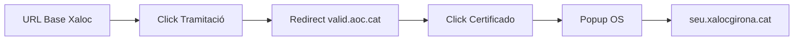

# 🎯 Plan de Acción: Proyecto Xaloc Automation

## Descripción del Proyecto

Automatización del trámite de **alegaciones de multas** en la Sede Electrónica de Xaloc Girona utilizando **Playwright** con Python asíncrono.

> Este es un **proyecto independiente** que seguirá una arquitectura similar a otros proyectos de automatización de trámites, pero con configuración y estructura propias.

---

## 📋 Checklist General

- [ ] **Fase 0:** Crear proyecto y estructura de carpetas
- [ ] **Fase 1:** Configurar navegador y perfil persistente
- [ ] **Fase 2:** Implementar flujo de login (VÀLid)
- [ ] **Fase 3:** Implementar rellenado de formulario STA
- [ ] **Fase 4:** Implementar subida de documentos
- [ ] **Fase 5:** Implementar confirmación final
- [ ] **Fase 6:** Testing y validación

---

## 🏗️ Fase 0: Estructura del Proyecto

### Crear Nuevo Proyecto

```bash
# Crear carpeta del proyecto
mkdir xaloc-automation
cd xaloc-automation

# Crear entorno virtual
python -m venv venv
venv\Scripts\activate  # Windows

# Instalar dependencias
pip install playwright
playwright install msedge
```

### Estructura de Carpetas

```
xaloc-automation/
├── main.py                     # Punto de entrada
├── config.py                   # Configuración y dataclasses
├── xaloc_automation.py         # Orquestador principal
├── error_handler.py            # Manejo de errores
├── validators.py               # Validaciones de UI
│
├── flows/                      # Flujos de automatización
│   ├── __init__.py
│   ├── login.py                # Autenticación VÀLid
│   ├── formulario.py           # Rellenado campos STA
│   ├── documentos.py           # Subida de archivos
│   └── confirmacion.py         # Pantalla final
│
├── profiles/                   # Perfiles navegador (con certificado)
│   └── edge_xaloc/
│
├── screenshots/                # Capturas de errores y finales
├── logs/                       # Logs de ejecución
└── test_files/                 # Archivos de prueba
```

---

## ⚙️ Fase 1: Configuración Base

### `config.py`

```python
from dataclasses import dataclass, field
from pathlib import Path
from typing import Optional, List

@dataclass
class ConfigNavegador:
    headless: bool = False
    perfil_path: Path = Path("profiles/edge_xaloc")
    canal: str = "msedge"
    args: List[str] = field(default_factory=lambda: [
        "--start-maximized",
        "--disable-blink-features=AutomationControlled"
    ])

@dataclass
class Timeouts:
    """Tiempos en milisegundos - STA es lento"""
    general: int = 30000
    login: int = 60000          # VÀLid + certificado
    transicion: int = 30000     # Entre pantallas STA
    subida_archivo: int = 60000

@dataclass
class DatosMulta:
    """Datos específicos del trámite de multas"""
    email: str
    num_denuncia: str
    matricula: str
    num_expediente: str
    motivos: str
    archivo_adjunto: Optional[Path] = None

@dataclass
class Config:
    navegador: ConfigNavegador = field(default_factory=ConfigNavegador)
    timeouts: Timeouts = field(default_factory=Timeouts)
    
    # URLs
    url_base: str = "https://www.xalocgirona.cat/seu-electronica?view=tramits&id=11"
    
    # Directorios
    dir_screenshots: Path = Path("screenshots")
    dir_logs: Path = Path("logs")
```

---

## 🔐 Fase 2: Login (VÀLid + Certificado)

### Flujo de Autenticación



### `flows/login.py`

```python
from playwright.async_api import Page, TimeoutError
import logging
from config import Config

async def ejecutar_login(page: Page, config: Config) -> Page:
    """Flujo completo de acceso a Xaloc via VÀLid"""
    
    logging.info(f"🌐 Navegando a {config.url_base}")
    await page.goto(config.url_base, wait_until="networkidle")
    
    # 1. Click en botón de trámite
    logging.info("🔗 Buscando enlace 'Tramitació en línia'")
    await page.get_by_role("link", name="Tramitació en línia").click()
    
    # 2. Esperar redirección a VÀLid
    logging.info("⏳ Esperando pasarela VÀLid...")
    await page.wait_for_url("**/valid.aoc.cat/**", timeout=10000)
    
    # 3. Seleccionar método certificado
    logging.info("🔐 Seleccionando certificado digital")
    await page.locator("#btnContinuaCert").click()
    
    # 4. El popup de certificado es del SO - perfil persistente lo maneja
    # 5. Esperar llegada al formulario STA
    logging.info("⏳ Esperando formulario STA...")
    await page.wait_for_url(
        "**/seu.xalocgirona.cat/sta/**", 
        timeout=config.timeouts.login
    )
    
    logging.info("✅ Login completado - Formulario STA cargado")
```

### Configuración del Certificado

> [!IMPORTANT]  
> Antes de ejecutar, configurar el certificado digital en el perfil de Edge:
> 1. Abrir Edge manualmente con el perfil `profiles/edge_xaloc`
> 2. Acceder a Xaloc y completar login con certificado
> 3. El navegador recordará la selección para futuras ejecuciones

---

## 📝 Fase 3: Formulario STA

### Selectores

| Campo | Selector | Notas |
|:------|:---------|:------|
| Email | `#contact21` | Input estándar |
| Nº Denuncia | `#DinVarNUMDEN` | Prefijo DinVar |
| Matrícula | `#DinVarMATRICULA` | Prefijo DinVar |
| Nº Expediente | `#DinVarNUMEXP` | Prefijo DinVar |
| Motivos | `iframe#DinVarMOTIUS_ifr` | Editor TinyMCE |

### `flows/formulario.py`

```python
from playwright.async_api import Page
import logging
from config import DatosMulta

async def rellenar_formulario(page: Page, datos: DatosMulta) -> None:
    """Rellena el formulario STA de alegación"""
    
    logging.info("📝 Rellenando formulario de alegación")
    
    # Campos de texto simples
    await page.locator("#contact21").fill(datos.email)
    await page.locator("#DinVarNUMDEN").fill(datos.num_denuncia)
    await page.locator("#DinVarMATRICULA").fill(datos.matricula)
    await page.locator("#DinVarNUMEXP").fill(datos.num_expediente)
    
    # Campo TinyMCE (dentro de iframe)
    logging.info("📝 Rellenando editor de motivos (TinyMCE)")
    editor = page.frame_locator("#DinVarMOTIUS_ifr")
    await editor.locator("body#tinymce").fill(datos.motivos)
    
    logging.info("✅ Formulario completado")
```

---

## 📂 Fase 4: Subida de Documentos

### `flows/documentos.py`

```python
from playwright.async_api import Page
from pathlib import Path
import logging

async def subir_documento(page: Page, archivo: Path) -> None:
    """Sube un documento adjunto al trámite"""
    
    if not archivo or not archivo.exists():
        logging.info("📂 Sin archivo para adjuntar, saltando...")
        return
    
    logging.info(f"📂 Subiendo: {archivo.name}")
    
    # Abrir modal de carga
    await page.locator("a.docs").click()
    await page.wait_for_selector("#fichero", state="visible")
    
    # Subir archivo
    await page.locator("#fichero").set_input_files(archivo)
    
    # Esperar procesamiento
    await page.wait_for_timeout(2000)
    await page.wait_for_load_state("networkidle")
    
    logging.info("✅ Documento subido")
```

---

## ✅ Fase 5: Confirmación Final

### `flows/confirmacion.py`

```python
from playwright.async_api import Page
from pathlib import Path
from datetime import datetime
import logging

async def confirmar_tramite(page: Page, screenshots_dir: Path) -> str:
    """Confirma el trámite y toma screenshot (NO ENVÍA)"""
    
    # 1. Marcar checkbox LOPD
    logging.info("☑️ Marcando aceptación LOPD")
    await page.locator("#lopdok").check()
    
    # 2. Esperar botón continuar
    await page.wait_for_selector("div#botoncontinuar", state="visible")
    
    # 3. Click continuar
    logging.info("➡️ Avanzando a pantalla final")
    await page.locator("div#botoncontinuar a").click()
    
    # 4. Esperar pantalla de envío
    await page.wait_for_url("**/TramitaSign", timeout=30000)
    await page.wait_for_load_state("networkidle")
    
    # 5. Screenshot de éxito
    timestamp = datetime.now().strftime("%Y%m%d_%H%M%S")
    screenshot_path = screenshots_dir / f"xaloc_final_{timestamp}.png"
    await page.screenshot(path=screenshot_path, full_page=True)
    
    logging.warning("🛑 PROCESO DETENIDO - Screenshot guardado")
    logging.warning("⚠️ Botón 'Enviar' NO pulsado (modo testing)")
    
    return str(screenshot_path)
```

> [!CAUTION]  
> **POLÍTICA DE TESTING:** El botón "Enviar" **NO se pulsa** para evitar crear registros reales en Xaloc.

---

## 🚀 Fase 6: Punto de Entrada

### `main.py`

```python
import asyncio
import sys
from pathlib import Path
from config import Config, DatosMulta
from xaloc_automation import XalocAsync

if sys.platform == "win32":
    sys.stdout.reconfigure(encoding='utf-8')

async def main():
    config = Config()
    
    # Datos de prueba
    datos = DatosMulta(
        email="test@example.com",
        num_denuncia="DEN/2024/001",
        matricula="1234ABC",
        num_expediente="EXP/2024/001",
        motivos="Alegación de prueba. Texto de ejemplo para testing.",
        archivo_adjunto=Path("test_files/documento.pdf")
    )
    
    print("\n🚀 INICIANDO AUTOMATIZACIÓN XALOC\n")
    
    async with XalocAsync(config) as bot:
        try:
            await bot.ejecutar_flujo_completo(datos)
            print("\n✅ Proceso finalizado con éxito")
        except Exception as e:
            print(f"\n❌ Error: {e}")
        finally:
            input("\nPulsa ENTER para cerrar...")

if __name__ == "__main__":
    asyncio.run(main())
```

---

## 🧪 Validaciones Pre-Producción

| Test | Criterio de Éxito |
|:-----|:------------------|
| Login | Llegada a `seu.xalocgirona.cat/sta/` |
| Formulario | Todos los campos con valor correcto |
| TinyMCE | Texto visible en editor |
| Documento | Nombre aparece en lista |
| Confirmación | Screenshot capturado |
| Sin envío | Botón Enviar **NO** pulsado |

---

## � Archivos a Crear (Resumen)

```
xaloc-automation/
├── main.py                  # ← Crear
├── config.py                # ← Crear
├── xaloc_automation.py      # ← Crear (orquestador)
├── error_handler.py         # ← Copiar/adaptar
├── validators.py            # ← Copiar/adaptar
├── flows/
│   ├── __init__.py          # ← Crear (vacío)
│   ├── login.py             # ← Crear
│   ├── formulario.py        # ← Crear
│   ├── documentos.py        # ← Crear
│   └── confirmacion.py      # ← Crear
├── profiles/edge_xaloc/     # ← Crear carpeta
├── screenshots/             # ← Crear carpeta
├── logs/                    # ← Crear carpeta
└── test_files/              # ← Crear carpeta
```

---

## ⏭️ Siguiente Paso

**Ejecutar estos comandos para inicializar el proyecto:**

```bash
mkdir xaloc-automation
cd xaloc-automation
mkdir flows profiles screenshots logs test_files
python -m venv venv
venv\Scripts\activate
pip install playwright
playwright install msedge
```
